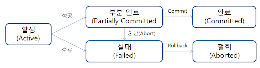

## 트랜잭션이란?

여러 작업을 하나로 묶은 작업수행의 **논리적 단위**입니다.

한 개 이상의 작업으로 구성되며 한 트랜잭션은 모두 실행되거나, 실행되지 않습니다.

### 트랜잭션의 상태

한 트랜잭션 플로우의 흐름입니다.

1. Active(활성)

   트랜잭션의 연산들이 정상적으로 실행 중인 상태.

2. Partially Committed(부분 완료)
 
   트랜잭션의 모든 연산들이 정상적으로 완료되었지만, **Commit연산** 직전의 상태.

3. Committed(완료)

   트랜잭션이 성공적으로 완료되어 **Commit연산**이 실행된 상태.

4. Failed(실패)

   트랜잭션이 오류/취소등의 이유로 중단된 상태.

5. Aborted(철회)
   
   트랜잭션이 비정상적으로 종료되어 **Rollback연산**을 수행한 상태.

***

## ACID

트랜잭션이 안전하게 수행된다는 것을 보장하기 위한 4가지 성질입니다.

### Atomicity (원자성)

모든 작업이 반영되거나, 모두 롤백되는 특성을 의미합니다. (**All or Nothing**)

트랜잭션 내의 모든 명령은 반드시 완벽히 수행되어야 하며,

모두가 완벽히 수행되지 않고 어느 하나라도 오류가 발생하면 트랜잭션 전부가 취소되어야 합니다.

1. Atomicity 보장

   수행중인 트랜잭션에 의해 변경된 내역은 유지하면서 이전 상태는 임시영역에 따로 저장합니다.

   오류가 발생하는 경우 임시영역에 저장되어있는 이전 상태를 롤백하여 원자성을 보장합니다.

   `롤백 세그먼트`: 임시로 저장되는 영역.

   `데이터베이스 테이블`: 현재 트랜잭션에 의해 새롭게 변경되는 내역.

### Consistency (일관성)

데이터에 대한 일관됨을 말합니다.

트랜잭션이 명령을 성공적으로 완료하면 언제나 일관성 있는 데이터베이스 상태로 유지합니다.

일관된 상태란 예를 들어 정수형 데이터는 트랜잭션이 동작한 이후에도 정수형을 유지하는 것을 의미합니다.

### Isolation (고립성)

둘 이상의 트랜잭션 간 명령의 간섭 정도를 말합니다.

트랜잭션이 동시에 병행 실행되는 경우 어느 하나의 트랜잭션이 실행 중 다른 트랜잭션의 명령에 끼어들 수 없습니다.

수행 중인 트랜잭션은 완전히 완료될 때까지 다른 트랜잭션에서 수행 결과를 참조할 수 없습니다.

아래와 같은 방법을 이용하여 고립성을 보장합니다.

1. 병행처리 (Concurrent Processing)

   각 트랜잭션에 일정 시간을 할당하여 시간을 모두 사용하면 다른 트랜잭션을 수행하는 방법입니다.

   **완료 여부**와 상관없이 트랜잭션이 변경되기 때문에 발생할 수 있는 이슈가 있습니다.

2. 고립성 보장

   병행처리에서 발생하는 이슈를 해결하기 위해 Lock(락)을 이용하여 해결합니다.

   **데드락**이슈가 발생할 가능성이 있습니다.

   > [DB의 Lock/DeadLock](https://akasai.space/db-lock)

3. 2PL Protocol (2-Phase Locking Protocol)

   데드락을 해결하기 위해 여러 트랜잭션이 공유하고 있는 데이터에 동시에 접근할 수 없도록 하기 위한 목적입니다.

   이름 그대로 2가지 단계의 Locking이 존재하는데 2PL 프로토콜은 상승 단계와 하강 단계와 섞이면 안된다는 것을 의미합니다.

   `Growing Phase(상승단계)`: Read_lock , Write_lock

   `Shrinking Phase`: Unlock

   즉, Lock과 Unlock이 번갈아 수행되지 않고 **Lock이 수행된 후에 Unlock이 수행**되어야 한다는 것이 이 프로토콜입니다.

### Durability (영속성)

한번 반영(커밋)된 내용은 영구적으로 적용되는 것을 말합니다.

***

## Reference

[[DB이론] 트랜잭션(transaction)과 ACID 특성을 보장하는 방법](https://victorydntmd.tistory.com/129)

