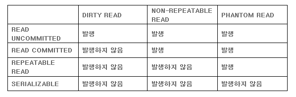
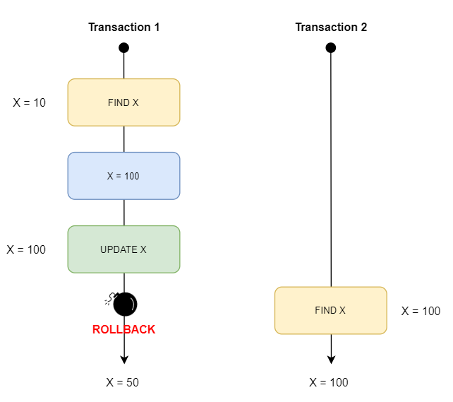
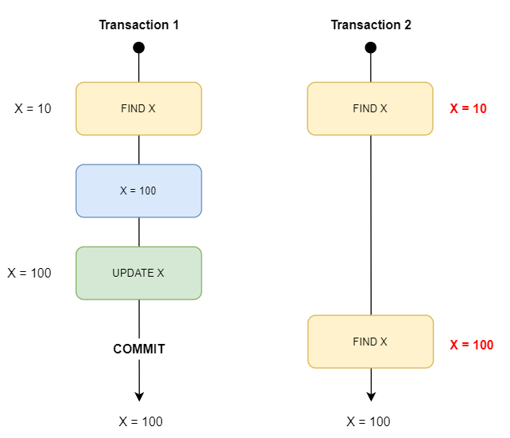
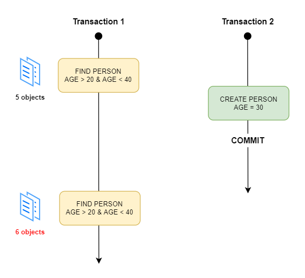
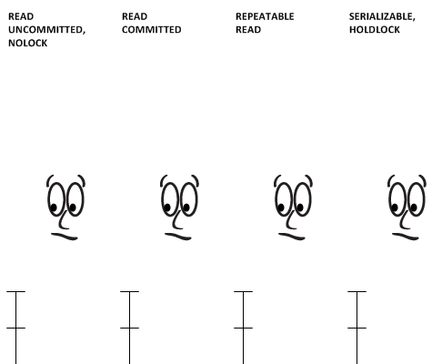

## 격리 수준(isolation level)이란?

격리수준(isolation level)이란 트랜잭션끼리 **얼마나 서로 고립되어 있는지를 나타내는 수준**입니다.

즉, 한 트랜잭션이 **다른 트랜잭션이 변경한 데이터**에 대한 접근 강도를 의미합니다.

레벨이 높아질수록 트랜잭션간 고립정도가 높아지며, 성능저하도 야기됩니다.

일반적인 온라인 서비스에서는 `READ COMMITTED`나 `REPEATABLE READ` 중 하나를 사용합니다.

*** 

## 필요성

격리수준은 트랜잭션의 `ACID 특성`을 보장하기 위해서 사용합니다.

`Locking`을 통해 이를 해결할 수 있지만, 무조건적인 Locking은 성능저하를 가져옵니다.

반대로 느슨한 Locking은 데이터 무결성에 큰 문제를 가져옵니다.

효율적인 Locking의 사용을 위해 **적절한 격리수준은 반드시 필요**합니다.

> [트랜잭션과 ACID](https://akasai.space/what-is-transction-and-acid)
> 
> [Lock이란?](https://akasai.space/db-lock)

***

## 상호작용

1. `Dirty Read`

   아직 **커밋(Commit)되지 않은** 다른 트랜잭션의 데이터를 읽는 것을 의미합니다.

2. `Non-repeatable Read`

   다른 트랜잭션이 커밋(Commit)한 데이터를 읽을 수 있는 것을 의미합니다.

   즉, 한 트랜잭션에서 같은 쿼리로 2번이상 조회했을 때 **그 결과가 상이한 상황**을 말합니다.

   보통 `데이터의 수정/삭제`가 발생했을 경우 발생합니다.

3. `Phantom Read`

   다른 트랜잭션이 커밋(Commit)한 데이터가 있더라도 자신의 트랜잭션에서 읽었던 내용만 사용하는 것을 의미합니다.
   
   즉, 한 트랜잭션에서 같은 쿼리를 2번이상 **조회했을 때 없던 결과가 조회**되는 상황을 말합니다. 
   
   보통 `데이터의 삽입`이 발생했을 경우 발생합니다.

***

## 격리 수준

### Read Uncommitted (Level 0)

어떤 트랜잭션의 내용이 **커밋(Commit)이나 롤백(Rollback)과 상관없이** 다른 트랜잭션에서 조회가 가능합니다. 정합성의 문제가 많은 격리 수준이기 때문에 RDBMS 표준에서는 **격리수준으로 인정하지 않습니다.**

`Select문`이 실행되는 동안 해당 Data에 Shared Lock이 걸리지 않습니다.

이런 이유로 `Dirty Read`가 발생합니다.

### Read Committed (Level 1)

한 트랜잭션의 변경내용이 **커밋(Commit)되어야만** 다른 트랜잭션에서 조회가 가능합니다. 대부분의 RDBMS에서 **기본적으로 사용하는 격리수준**입니다.

`Select문`이 실행되는 동안 Shared Lock이 걸립니다. 조회시에는 실제 테이블 값이 아니라 **Undo 영역에 백업된 레코드** 값을 가져옵니다.

하지만 하나의 트랜잭션에서 똑같은 SELECT 쿼리를 실행했을 때는 항상 같은 결과를 가져와야 하는 `REPEATABLE READ`의 정합성에 어긋납니다. 즉, `Non-repeatable Read`이 발생합니다.

### Repeatable Read (Level 2)

트랜잭션이 시작되기 전에 커밋된 내용에 대해서만 조회가 가능합니다. MySQL에서 기본으로 사용하며, 이 격리수준에서는 `Non-repeatable Read`이 발생하지 않습니다.

트랜잭션이 완료될 때까지 Select문이 사용하는 모든 데이터에 Shared Lack이 걸립니다. 따라서 트랜잭션이 범위 내에서 조회한 데이터의 내용이 항상 동일함을 보장합니다.

트랜잭션이 시작 시점 데이터의 일관성을 보장해야 하기 때문에 트랜잭션의 실행시간이 길어질수록  계속 **멀티 버전을 관리**해야 하는 단점이 발생합니다.

하지만 `Phantom Read`가 발생할 수 있습니다.

### SERIALIZABLE (Level 3)

가장 **단순하면서 엄격한 격리 수준**이지만 성능 측면에서는 동시 **처리성능이 가장 낮습니다**. `SERIALIZABLE`에서는 `PHANTOM READ`가 발생하지 않습니다.

트랜잭션들이 동시에 일어나지 않고, 순차적으로 실행되는 것처럼 동작합니다.

하지만, 거의 사용되지 않습니다.

***

## 요약

각 DBMS에 따라서 Default Level도 다르고 각 수준의 동작 방식도 상이합니다.

하지만 **Isolation Level**이 존재하는 이유는 모두 동일하기 때문에 큰 틀에선 같다고 할 수 있습니다.

**기본 개념을 바탕으로 본인이 사용하는 DBMS에서 제공하는 정보를 확인하며 적용하는 것**이

가장 적절한 방법일 것입니다.

***

## Reference

[트랜잭션 격리 수준(Isolation Level)](https://doooyeon.github.io/2018/09/29/transaction-isolation-level.html)

[트랜잭션의 격리 수준(isolation Level)이란?](https://nesoy.github.io/articles/2019-05/Database-Transaction-isolation)

[[PostgreSQL] transaction isolation](https://brownbears.tistory.com/272)

