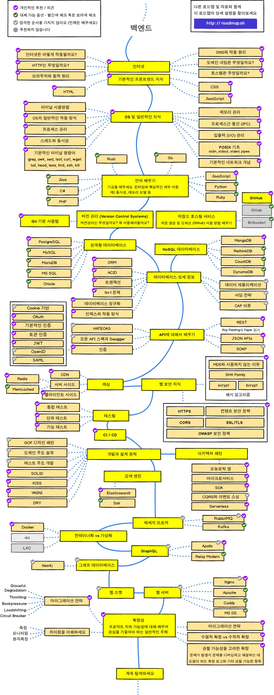
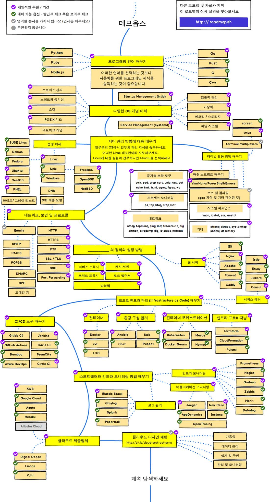

꾸준히 업데이트되고 있는 로드맵이다.

해외 개발자들이 오픈소스로 정리하고 배포하는 프로젝트인데

한글로 번역된 내용이 있어서 올려본다.

무조건 정답이라고 할 순 없지만 충분히 도움이 되는 것 같다.

(다른 파트 로드맵은... 사이트에서)

***

## 백엔드 개발자

***

## 데브옵스 개발자

*** 

## Reference

[Developer Roadmaps](https://roadmap.sh/)

[Github](https://github.com/kamranahmedse/developer-roadmap)

[Github: Korean](https://github.com/devJang/developer-roadmap)

