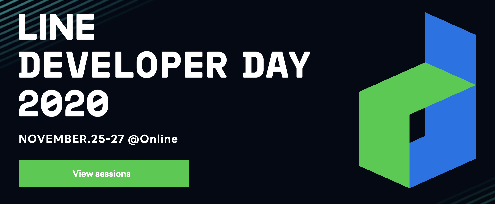

지인의 추천으로 팀에서 진행한 발표내용을 보게되었다.

이를 보고 간략하게 느낌 부분을 적어보려 한다.

***

## Devday2020

[Devday2020](https://linedevday.linecorp.com/2020/en)

`Line`에서 언택트로 진행한 개발자 컨퍼런스이다.

아쉽게도 일본 시장을 대상으로 잡고 진행한 컨퍼런스라서 국내에 홍보가 크게 되지 않았다.

공식 홈페이지에서도 영어나 일본어로만 더빙이 된 발표만 봐도 조금 아쉬운 점도 있었다. (심지어는 공식 홈페이지의 **l13n**도 en | jp 뿐이다.)

물론 일본 개발자뿐만아니라 국내 개발자들의 발표도 많았다.

해당 발표제목을 `유튜브`에서 검색하면 한국어로 된 발표를 볼 수 있다.

~~절대 내가 영어를 못해서가 아니다.~~

### Story that built Sentry as an On-Premise

[Youtube Link](https://youtu.be/LOCByPfbQsk)

`Line UIT`팀이 [Sentry](https://www.sentry.io)를 도입하게 된 이유와 방법에 대한 설명이었다.

백엔드 개발자의 눈으로 봐도 대부분의 로깅 시스템이 백엔드 친화적인 느낌이 강하다. (물론 케바케지만...)

이를 프론트엔드 친화적으로 스택트레이스를 살펴보고자 하는 니즈에서 시작된 프로젝트라고 느껴졌다.

더군다나 센트리의 과금정책이 존재하지만 오픈소스라는 이점을 살려 이를 **On-Premise 환경**에 올려서 운영한다는 부분도 인상 깊었다.

이해도만 충분하다면 보안적, 범용적 측면에서 On-Premise 환경만큼 좋은 것은 없을 것이다. (관리적 측면은 다음에 생각하자)

오픈소스이므로 개발 분야와 상관없이 도입을 고려해보아도 좋겠다는 생각이 들었다.

* Sentry : [Github](https://github.com/getsentry)

   오류로그나 오류의 스택트레이스를 모아서 보여주는 서비스. 
   
   다양한 언어, 프레임워크를 지원하는 통합오류모니터링 솔루션.

   > Sentry's application monitoring platform helps every developer diagnose, fix, and optimize the performance of their code.

### How to quickly develop static pages in LINE

[Youtube Link](https://youtu.be/lclP6MbSdG4)

`Line UIT`팀이 Static 페이지 개발속도에 대한 개선사항들을 소개한다.

정적페이지라고도 불리는 이 페이지는 많은 부분에서 다양하게 사용 중이다.

동료 프론트엔드 개발자들만 봐도 디자인단계부터 에셋(Assets) 등이 준비되고 작업을 시작하면 3~5일 정도의 개발 기간이 소요되는 것 같은데

이것을 1일(하루) 만에 완성하는 획기적인 단축 방법을 소개한다.

기본 개념은 "**중복을 줄이고 자동화할 수 있는 부분은 자동화하자**"인 것 같다.

가장 인상 깊었던 것은 `Land Press`라는 도구의 이용과 `CLI개발을 이용한 자동화`였다.

아쉽게도 `Land Press`는 **사내 private 패키지**라고 한다 

프론트엔드 개발자가 아니여서 대략적인 내용만 이해할 수 있었지만 

약간의 경험만 있다면 이해하는데 크게 문제없을 내용이었다.

***

## 요약

우선 추천받은 2가지의 세션만 들어보았다.

Front-end/Back-end라는 벽을 허물고 다양한 측면에서 성능개선을 위해 다양한 기술을 채택하고 있다는 점이 인상 깊었다.

기회가 된다면 Sentry는 경험할 수 있는 부분은 직접 경험해본 뒤 적용해보고 싶다.

*** 

## Reference

[Line Developer Day 2020](https://linedevday.linecorp.com/2020/en)

[Line Youtube - Korea sub.](https://www.youtube.com/playlist?list=PLI2S-k0Fa59vrCkUC9G8kiu7w4PRXJI_5)

[Sentry.io](https://www.sentry.io)

