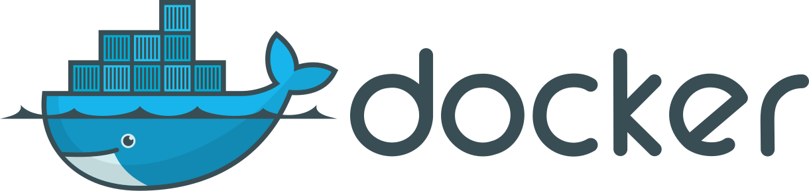
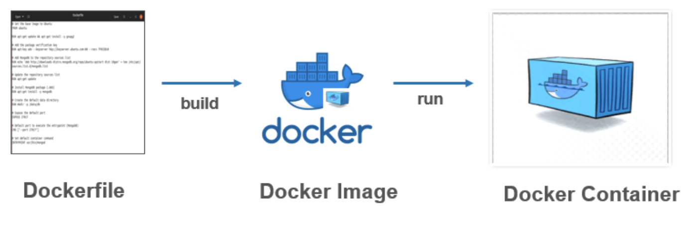

지속적으로 업데이트할 예정입니다.

도커와 관련된 용어들을 정리해본다.

***

## Docker

기존의 VM(Vertual Machine)처럼 하드웨어 기반 가상화가 아닌 **커널을 공유하는 프로세스 기반 가상화 방법**이다.

Host OS 위 `도커엔진` 위에서 동작하며 Host의 커널을 공유한다.

`이미지`와 `컨테이너`로 구분되며, 설정값을 이미지로 구성하여 컨테이너에서 실행하는 개념

1. **도커파일** : 서버 운영 기록을 코드화한 것

2. **도커 이미지** : 도커 파일에 실행할 시점을 더한 것. 실행에 필요한 파일과 설정값들을 포함하고 있는 것

3. **도커 컨테이너** : 도커 이미지에 실행 시점에 수정되어야 할 정보들을 더한 것. (도커이미지 + 환경 변수)

도커 파일로 이미지를 만들어 두면, 서버가 구성되는 시점이 이미지를 만든 시점으로 고정된다.
 
이미지를 실행시키는 시점이 언제든 같은 모양이다. 그렇기 문에 서버를 항상 똑같은 상태로 만들 수 있다.

### 이미지

컨테이너를 실행하기 위한 의존성, 설정 등의 모든 정보를 가지고 있다.

추가되거나 수정되는 내용을 효율적으로 관리하기 위해 레이어라는 개념과 유니온 파일 시스템을 이용한다.

### 컨테이너

이미지의 인스턴스이며 분리된 하드웨어 자원을 가진다.

### 특징

1. **Docker엔진**을 이용한 구성으로 Guest OS를 필요로하지 않는다.

2. 1번의 이유로 VM과 비교하면 월등한 **실행속도**를 보여준다.

3. 하드웨어 가상화가 아니므로, 메모리 엑세스, 파일시스템, 네트워크 등의 실행 **성능이 향상**된다.

4. 서버 환경에 대한 구현이 간단해지며 **동일한 환경**을 쉽게 재현할 수 있다.

*** 

## Reference

[초보를 위한 도커 안내서 - 도커란 무엇인가?](https://subicura.com/2017/01/19/docker-guide-for-beginners-1.html)

