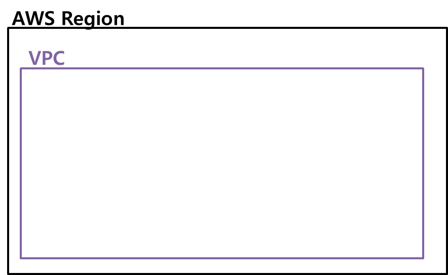
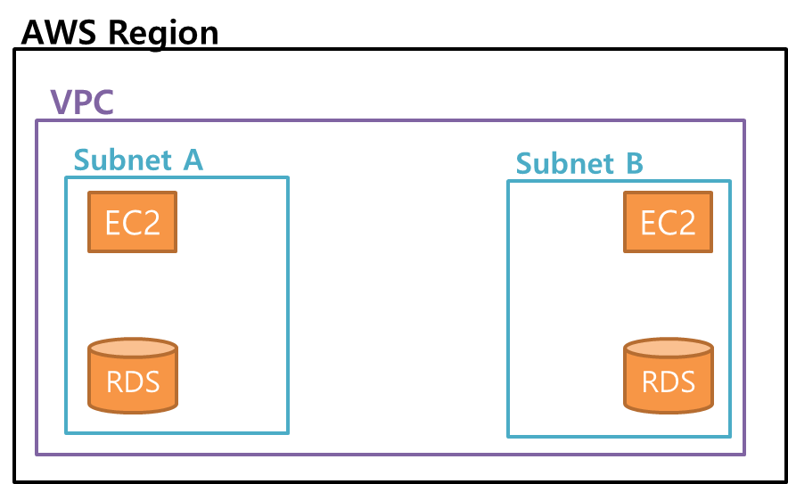
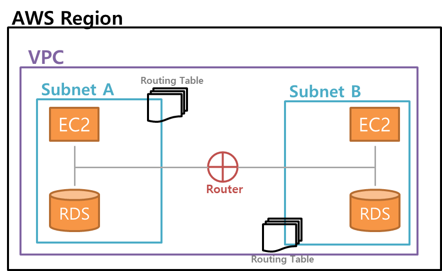
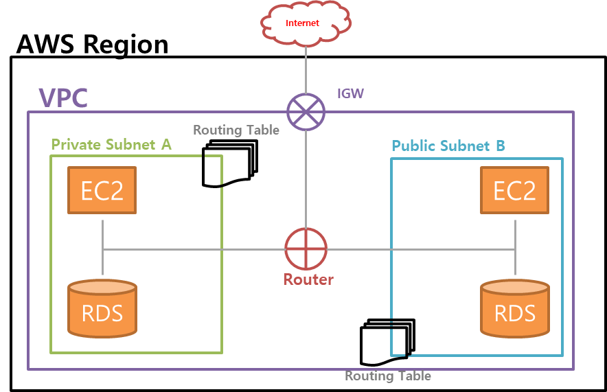
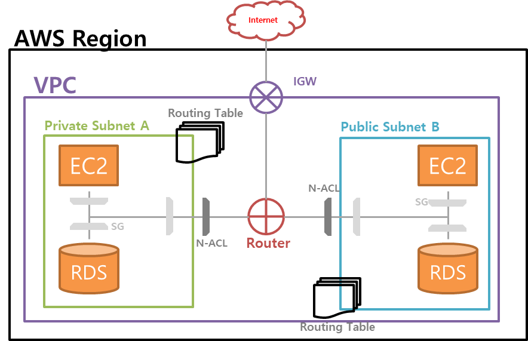
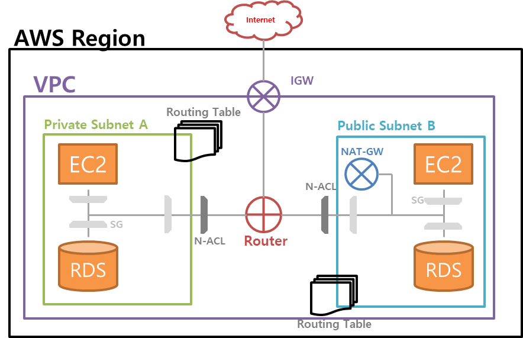

AWS기반의 클라우드 환경을 사용하면 자연스럽게 사용하게 되는 리소스가 바로 `VPC`입니다.

전반적인 구성요소에 대한 개념을 간단하게 알아봤습니다.

***

## VPC (Virtual Private Cloud)

논리적으로 **격리된 네트워크**를 의미합니다.

완전히 독립적인 네트워크로서 **실제로 같은 네트워크상에 존재**하지만, 논리적으로 **다른 네트워크인 것처럼 동작**합니다.

`이름`과 `IPv4 CIDR` 블록으로 구성되어 있으며, 사설 아이피 대역에 맞추어 구축되어야 합니다.

> **사설(Private) 아이피**: 아파트의 실제 주소 
>
> **공인(Public) 아이피**: 아파트의 호수

넷마스크 숫자는 IP의 범위를 나타내며 계산 방법은 `2^(32-n)`입니다.

 
192.123.0.0/24 면 2^(32-24)=256. 즉, 245개의 IP주소를 의미합니다. (192.123.0.0 ~ 192.123.1.255)

VPC의 최대 크기는 `16`입니다. 즉, 2^(32 - 16) = `65536`개의 IP를 사용가능합니다.

> **VPC에서 사용하는 사설아이피 대역**
>
> Class A: 10.0.0.0 ~ 10.255.255.255 (8bit)
> 
> Class B: 172.16.0.0 ~ 172.31.255.255 (12bit)
> 
> Class C: 192.168.0.0 ~ 192.168.255.255 (16bit)

***

## Subnet

더 많은 네트워크망을 만들기 위해 VPC를 잘게 쪼개는 과정입니다.

실제로 리소스가 생성되는 물리적 공간과 연결됩니다.

각각의 서브넷은 가용영역 안에 존재하며 `RDS`, `EC2`와 같은 리소스를 위치시킬 수 있습니다.

VPC보다 작은 단위이기 때문에 서브넷 마스크는 VPC보다 높습니다.

서브넷의 넷마스크 범위는 `16(65535개) ~ 28(16개)`입니다.

***

## 라우팅 테이블

서브넷과 연결된 리소스입니다.

라우터는 `목적지`, 라우팅 테이블은 `이정표` 역할을 합니다.

데이터는 우선 라우터로 향하며 네트워크 요청은 각각 정의된 라우팅 테이블에 따라 작동합니다.

단, 외부로 통하는 트래픽을 처리할 순 없습니다.

**인터넷 연결이나 다른 VPC와의 통신은 라우팅 테이블에 규칙을 추가**해야 합니다.

***

## 인터넷 게이트웨이 (IGW)

VPC와 인터넷을 연결해주는 하나의 관문입니다.

VPC는 격리된 환경이므로 기본적으로 내부 리소스는 인터넷을 사용할 수 없습니다.

인터넷과 연결되어있는 서브넷을 `퍼블릭 서브넷`, 인터넷과 연결되어있지 않는 서브넷을 `프라이빗 서브넷`이라고 합니다.

***

## DHCP 옵션셋

TCP/IP 상의 호스트로 설정정보를 전달하는 DHCP(Dynamic Host Configuration Protocol) 표준입니다.

도메인 네임 서버(DNS), 도메인 네임(DN)등의 설정을 합니다.

***

## 네트워크 ACL

**Outbound, Inbound** 트래픽을 제어하는 **가상 방화벽**입니다.

`Stateless`하게 작동하며 서브넷 단위로 적용가능합니다.

***

## 시큐리티 그룹

서브넷 뿐만 아니라 인스턴스 앞단에서 트래픽을 제어하는 **가상 방화벽**입니다.

`Stateful`하게 작동하며 모든 허용을 차단하도록 기본설정되어 있습니다.

### Stateful vs Stateless

**Stateless**란 `HTTP`와 같이 Client의 이전 상태를 기록하지 않는 접속을 의미합니다.

**Stateful**은 Client의 이전 상태를 기록하고 있는 젒속을 의미합니다.

즉, Stateless는 웹서버가 사용자의 작업을 기억하지 않으며, Stateful은 사용자의 상태를 서버가 기억하고 활용하는 것입니다.

***

## NAT

Private 서브넷이 인터넷과 통신하기 위한 **아웃바운드 인스턴스**입니다.

인바운드는 허용하지 않더라도 업데이트 등의 이유로 아웃바운드가 필요합니다.

NAT는 `Public 서브넷`에서 동작하며 Private 서브넷에서 요청하는 아웃바운드 트래픽을 `IGW`와 연결합니다.

> 인바운드: 외부 → 내부
>
> 아웃바운드: 내부 → 외부
 

*** 

## Reference

[[AWS] 가장쉽게 VPC 개념잡기](https://medium.com/harrythegreat/aws-%EA%B0%80%EC%9E%A5%EC%89%BD%EA%B2%8C-vpc-%EA%B0%9C%EB%85%90%EC%9E%A1%EA%B8%B0-71eef95a7098)

[AWS VPC란?](https://velog.io/@may_soouu/AWS-VPC%EB%9E%80)

