자바스크립트 V8엔진과 Node.js 런타임을 기반으로 비동기처리가 어떻게 처리되는지

이벤트 루프의 동작방식등을 정리한다.

***

## 이벤트 루프

이벤트 루프는 콜 스택과 큐를 감시하며 비어있는 콜 스택에 작업을 넣는 작업(Tick)을 수행한다.

MDN의 이벤트 루프의 간이 코드를 통해 `Tick`의 대략적인 동작원리가 설명된다.

```javascript
while(queue.waitForMessage()) {
    queue.processNextMessage();
}
```

`Queue.waitForMessage()`를 통해 작업이 도착할 때까지 **동기적으로** 기다린다.

<span class="callout">
동시에 발생하는 다양항 작업들을 큐에 쌓고 이벤트 루프를 통해 실행하므로써 동시성을 확보하는 것이다.<br>
실제로 작업이 동시에 수행되는 것은 아니다.
</span>

콜 스택에 올라간 작업은 되므로 `Run-to-completion` 으로 동작한다.

### 구조


>The event loop is what allows Node.js to perform non-blocking I/O operations — despite the fact that JavaScript is single-threaded — by offloading operations to the system kernel whenever possible.
>Since most modern kernels are multi-threaded, they can handle multiple operations executing in the background. When one of these operations completes, the kernel tells Node.js so that the appropriate callback may be added to the poll queue to eventually be executed. We'll explain this in further detail later in this topic.

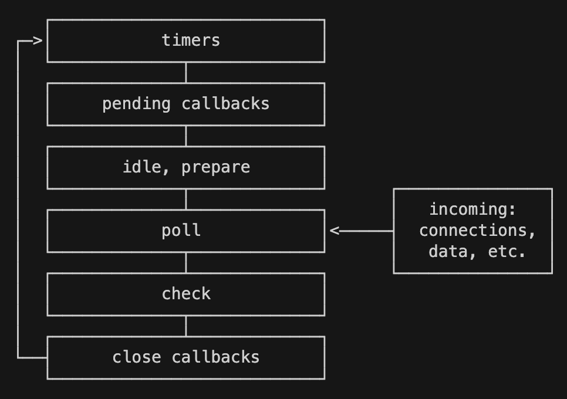

위 Node.js공식문서의 설명처럼 **이벤트 루프**는 시스템 커널에 작업을 넘기므로써 싱글스레드임에도 논블로킹 I/O 작업을 수행한다.
대부분의 현대 커널은 멀티스레드이므로 넘겨받은 다수의 작업을 수행가능하며, 작업이 완료되면 Node.js로 다시 알려주어 콜백을 poll queue에 추가할 수 있도록 한다.

위 구조를 살펴보면

1. Timers

   `setTimeout()`과 `setInterval()`로 스케줄링한 콜백을 실행

2. Pending callbacks

   **close callback**, **Timer로 스케줄링된 콜백**, `setImmediate()`를 제외한 거의 모든 콜백을 실행

3. Idle, prepare

   내부용으로만 사용

4. Poll

   새로운 I/O 이벤트를 가져옴. 적절한 시기에 node는 여기서 블록

5. Check

   `setImmediate()` 콜백 invoke

6. Close callbacks

   e.g: `socket.on(‘close’, ….)`

### 동작 원리 - callback

ES6 이전 callback함수를 이용한 Node.js의 이벤트 루프는 **Task queue**를 이용하여 작업이 수행되었다.

```javascript
function first(){
    console.log(111)
    second()
}

function second() {
    setTimeout(function cb() {
        console.log(222)
    }, 0)
    third()
}

function third() {
    console.log(333)
}

first() // ????
```

앞서 정리했듯이 각 함수는 콜 스택에 **FILO** 형태로 쌓이고 수행된다.

따라서, 위 함수들의 실행 절차를 살펴보면

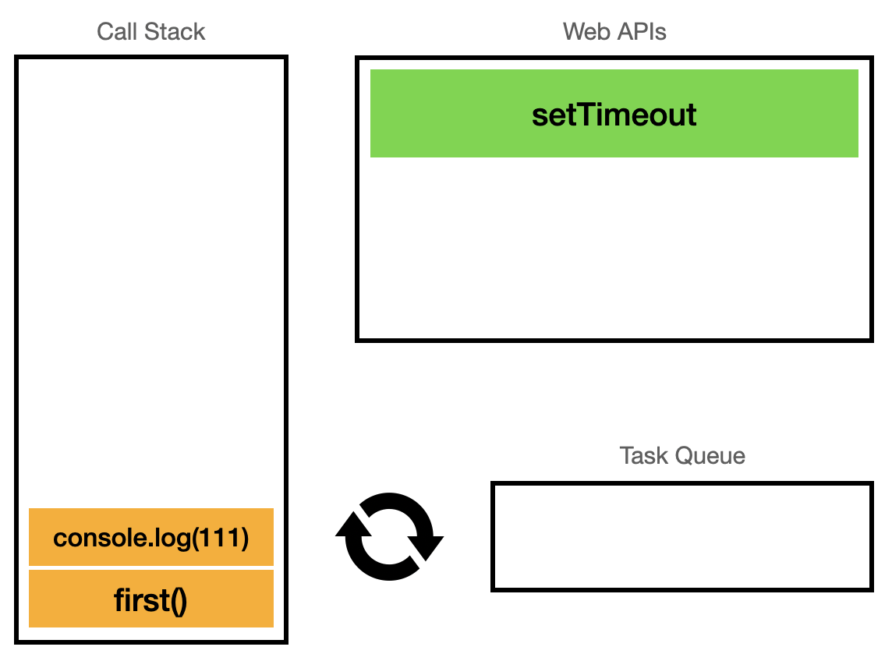

1. `first()`함수가 실행된 후 `console.log`를 통해 **111**이 출력된다.

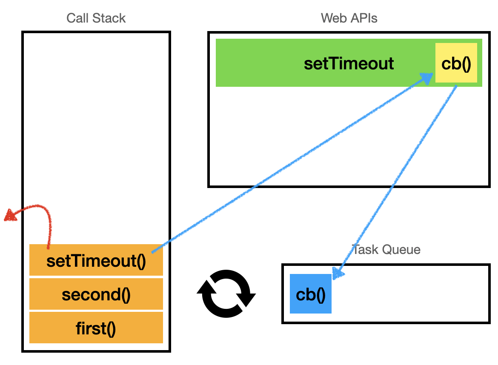

2. `second()`함수가 실행된 후 `setTimeout()`함수는 콜스택에서 바로 빠져나오고 런타임의 **Web API**에게 요청된다.<br>`cb()`함수는 **Task Queue**에 쌓인다.

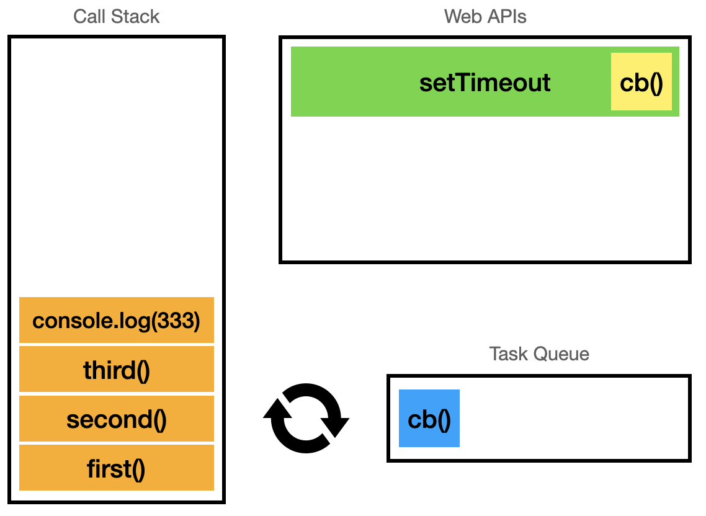

3. `third()`함수가 실행되고 `console.log`를 통해 **333**이 출력된다.

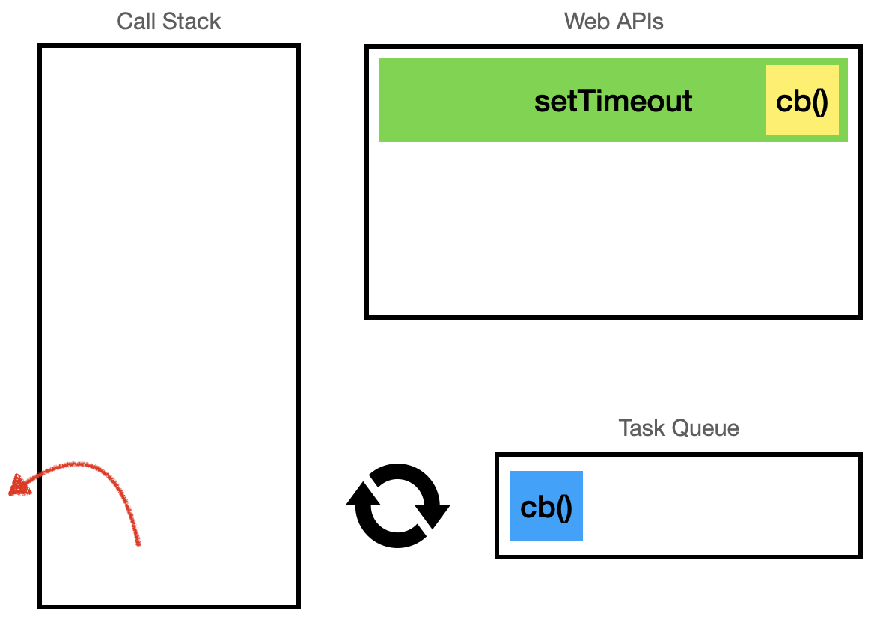

4. 모든 함수의 실행이 끝나고 콜 스택이 비워진다.

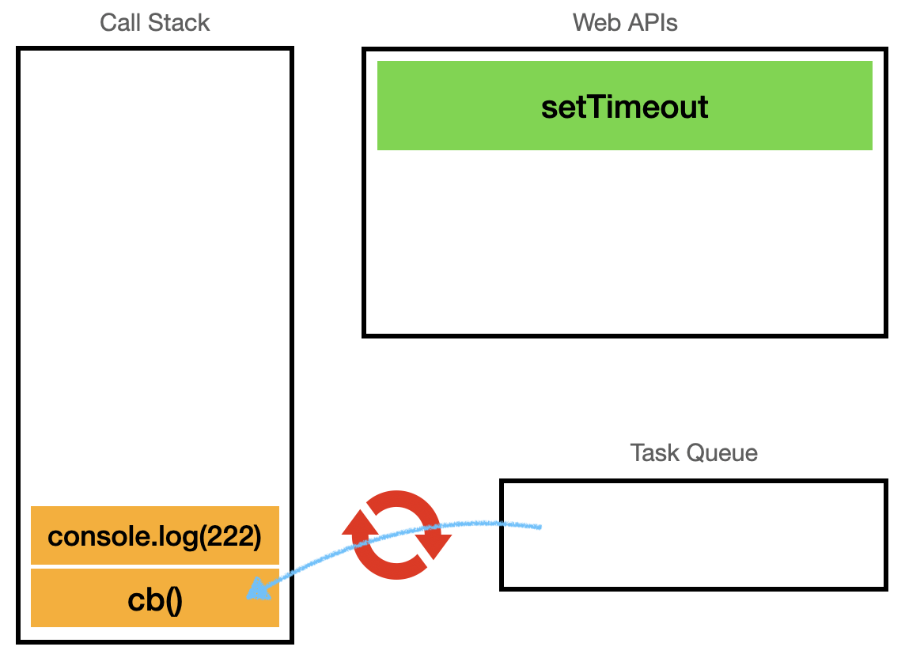

5. 콜 스택이 비어있는 것을 확인한 **Event Loop**는 **Task Queue**에서 대기하고 있던 `cb()`함수를 콜스택에 담는다.

6. 마지막으로 콜 스택에 담긴 `cb()`함수가 실행되고 `console.log`를 통해 **222**가 실행된다.

```javacript
// 실행결과
111
333
222
```

> **[loupe](http://latentflip.com/loupe)**
>
> 위 사이트에서 대략적인 플로우를 확인해볼 수 있다. (callback 한정)

### 동작 원리 - promise

ES6의 공개로 Promise함수들이 추가되고 이를 처리하는 `Microtask Queue`의 개념도 추가되었다.

앞서 정리한 Queue의 종류를 바탕으로 이벤트 루프의 동작 순서를 정리해보면

```javascript
function first() {
    console.log(111)
    second()
}

function second() {
    setTimeout(function cb1() {
        console.log(222)
    }, 0)
    third()
}

function third() {
    Promise.resolve()
        .then(function cb2() {
            console.log(333)
        })
    fourth()
}

function fourth() {
    requestAnimationFrame(function cb3() {
        console.log(444)
    })

    fifth()
}

function fifth() {
    console.log(555)
}

first()
```

`setTimeout()` 함수만 사용하는 것이 아니라 `Promise().resolve()`와 `requestAnimationFrame()`함수를 이용하여

동작시켜보면 동작순서는

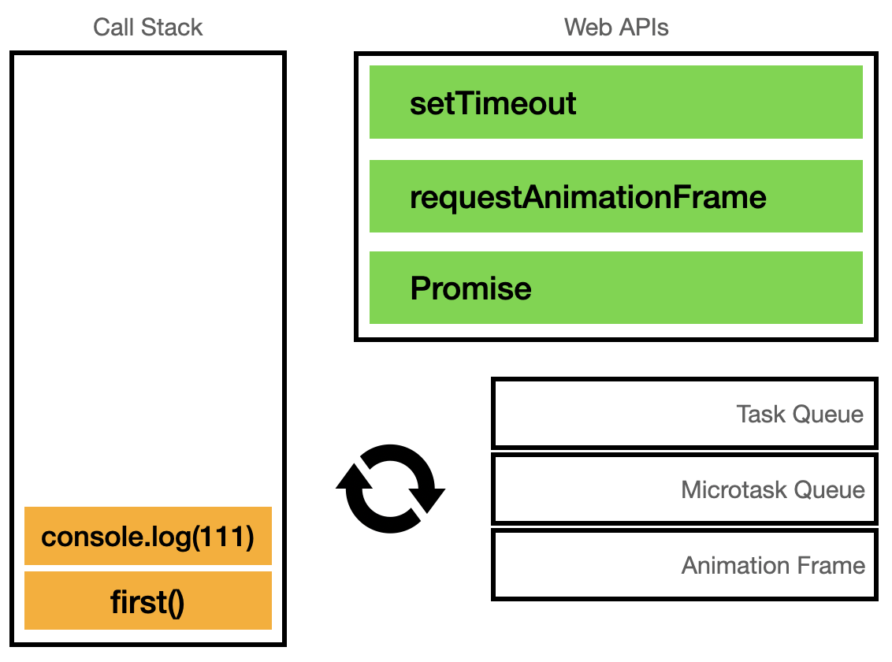

1. `first()`함수가 실행된 후 `console.log`를 통해 **111**이 출력된다.

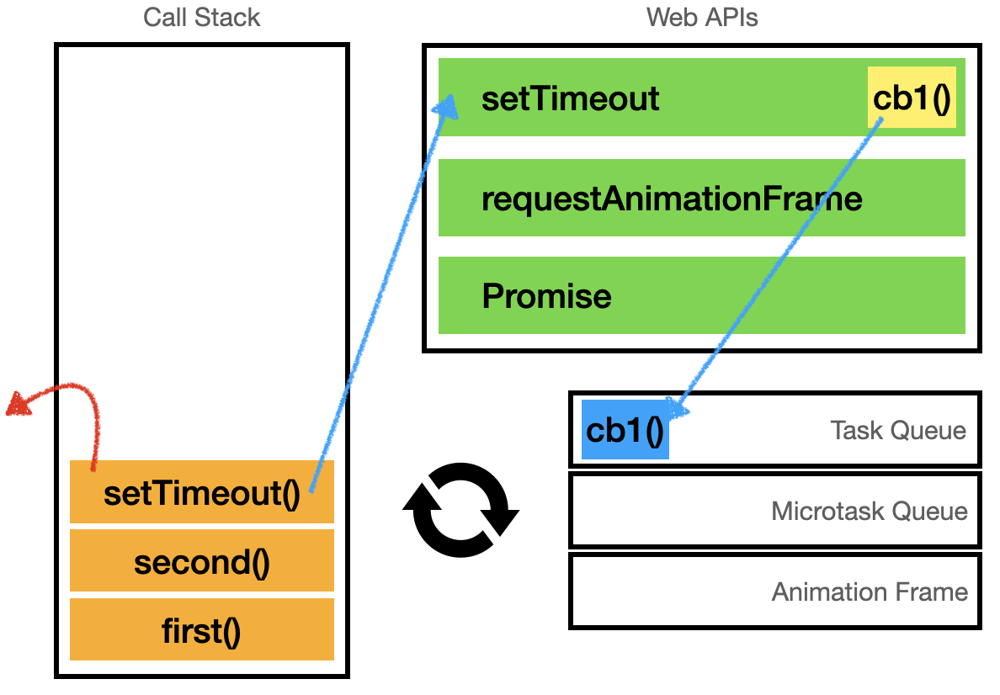

2. `second()`함수가 실행된 후 `setTimeout()`함수는 콜스택에서 바로 빠져나오고 런타임의 **Web API**에게 요청된다. `cb1()`함수는 **Task Queue**에 쌓인다.

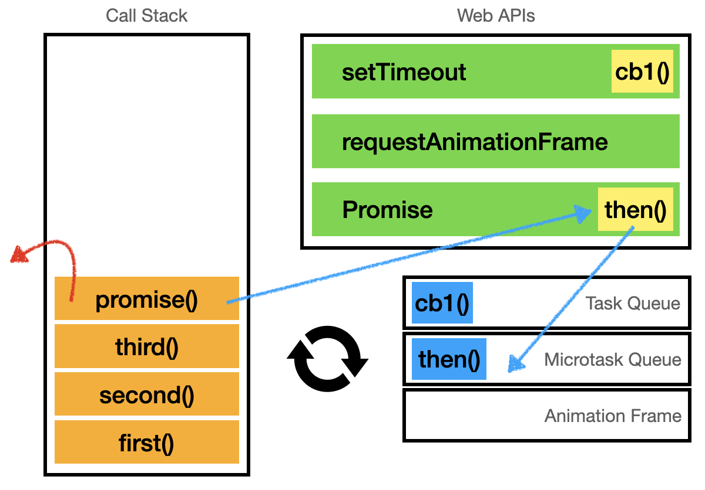

3. `third()`함수가 실행된 후 `Promise()`함수는 콜스택에서 바로 빠져나오고 런타임의 **Web API**에게 요청된다. `then()`함수는 **Microtask Queue**에 쌓인다.

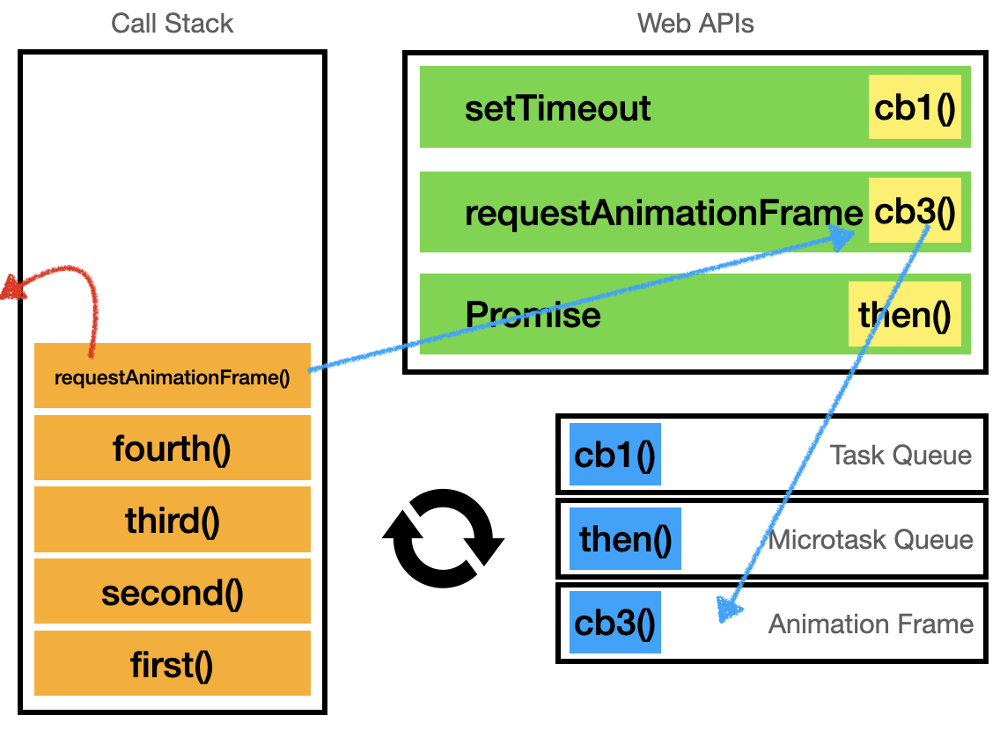

4. `fourth()`함수가 실행된 후 `requestAnimationFrame()`함수는 콜스택에서 바로 빠져나오고 런타임의 **Web API**에게 요청된다. `cb3()`함수는 **Animation frames**에 쌓인다.

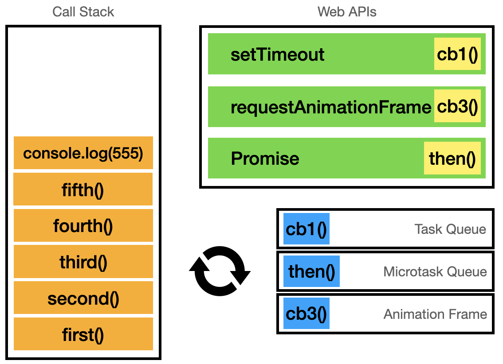

5. `fifth()`함수가 실행되고 `console.log`를 통해 **555**이 출력된다.

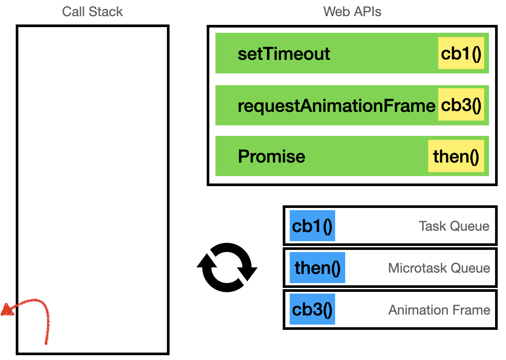

6. 모든 함수의 실행이 끝나고 콜스택에서 한개씩 **pop**된다.

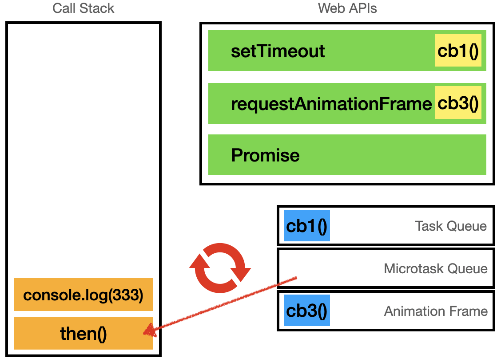

7. 콜 스택이 비어있는 것을 확인한 **Event Loop**는 **Microtask Queue**에서 대기하고 있던 `then()`함수를 콜스택에 담는다.

8. `then()`함수가 실행되고 `console.log`를 통해 **333**가 실행된다.

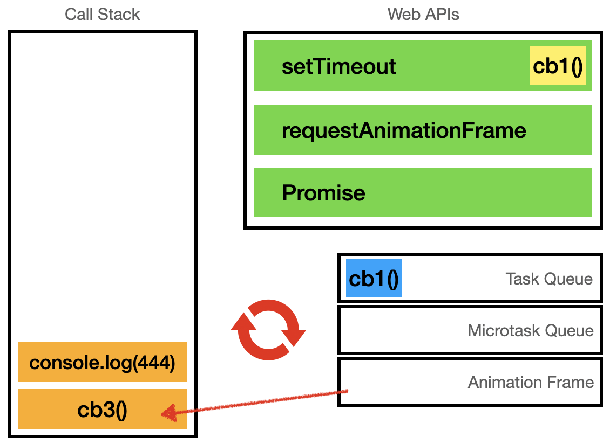

9. 콜 스택이 비어있는 것을 확인한 **Event Loop**는 **Animation frames**에서 대기하고 있던 `cb3()`함수를 콜스택에 담는다.

10. `cb3()`함수가 실행되고 `console.log`를 통해 **444**가 실행된다.

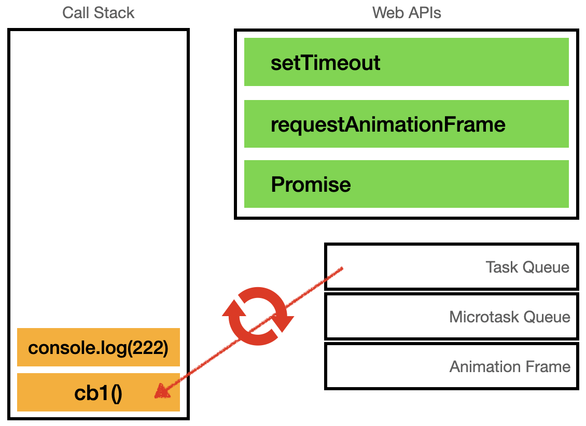

11. 콜 스택이 비어있는 것을 확인한 **Event Loop**는 **Task Queue**에서 대기하고 있던 `cb1()`함수를 콜스택에 담는다.

12. 마지막으로 콜 스택에 담긴 `cb1()`함수가 실행되고 `console.log`를 통해 **222**가 실행된다.


```javacript
// 실행결과
111
555
333
444
222
```

> **[tasks-microtasks-queues-and-schedules/](https://jakearchibald.com/2015/tasks-microtasks-queues-and-schedules/)**
>
> 위 사이트에서 대략적인 플로우를 확인해볼 수 있다.

***

## Summary

Queue의 호출순서 우선순위는 **Microtask Queue > Animation Frames > Task Queue** 순이다.

<span class="callout">
이러한 동작들은 브라우저마다 호출 순서가 다를 가능성이 있다. Promise의 처리방식이 브라우저 별로 다르기 때문이다.
</span>

<span class="callout">
setTimeout함수의 경우 `delay` 파라미터를 통해 딜레이를 조절할 수 있다. <br>
하지만 위와 같은 플로우를 통해 작업이 진행되므로 약간의 오차가 발생한다.
</span>

위 플로우를 충분히 이해하고 본다면 가장 눈에 잘들어오는 아키텍처는 아래와 같다.

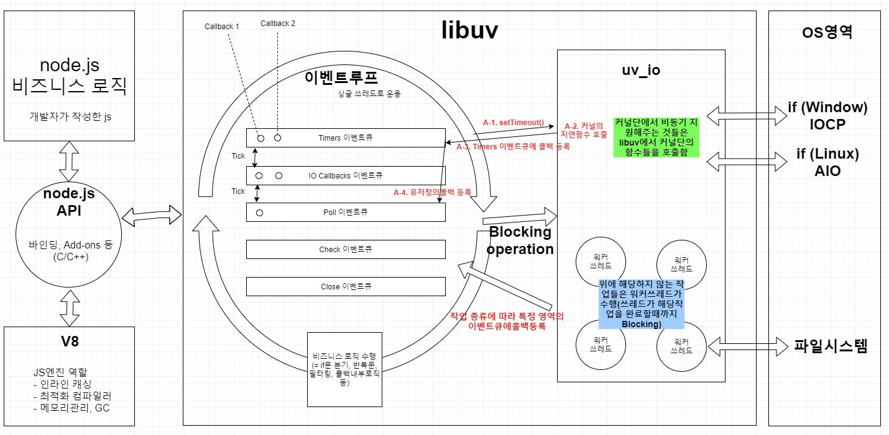

***

## Reference

<span class="reference">

[Node.js Doc: EventLoop](https://nodejs.org/en/docs/guides/event-loop-timers-and-nexttick/#what-is-the-event-loop)

[MDN: EventLoop](https://developer.mozilla.org/en-US/docs/Web/JavaScript/EventLoop)

[[JS] Javascript의 Event Loop](https://asfirstalways.tistory.com/362)

[[Javascript] 자바스크립트의 호출 스택과 이벤트 루프](https://iamsjy17.github.io/javascript/2019/07/20/how-to-works-js.html)

[nodejs의 내부 동작 원리 (libuv, 이벤트루프, 워커쓰레드, 비동기)](https://sjh836.tistory.com/149)

</span>
