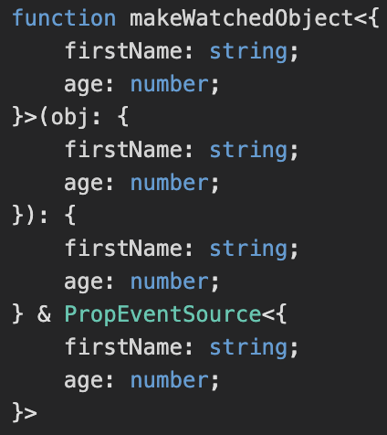

11월 19일 Typescript 4.1이 릴리즈되었다.

한달이 지난 시점이지만, 대략적인 내용을 정리해 보았다.


***

## Template Literal Types

### String literal types

`Typescript`에서는 문자열 나열형태의 타입을 지원한다.

```typescript
function setVerticalAlignment(pos: "top" | "middle" | "bottom") {
    // ...
}

setVerticalAlignment("middel")
// error: Argument of type '"middel"' is not assignable to parameter of type '"top" | "middle" | "bottom"'.
```

위 처럼 활용하면 파라미터의 **스펠체크**가 가능한 형태의 타입이였다.

이를 활용해서 좀 더 다양한 타입정의를 할 수 있다.

```typescript
type Options = {
    [K in "noImplicitAny" | "strictNullChecks" | "strictFunctionTypes"]?: boolean
}
// same as
//   type Options = {
//       noImplicitAny?: boolean,
//       strictNullChecks?: boolean,
//       strictFunctionTypes?: boolean
//   }
```

### Template literal string type

`Javascript`의 **템플릿 스트링**을 활용하여 `TS4.1`에서는 좀 더 다양한 타입을 선언할 수 있게 되었다.

```typescript
type World = "world"

type Greeting = `hello ${World}`
// same as
//   type Greeting = "hello world"
```

이를 응용하면 길게만 느껴진 나열형태의 타입선언이 아주 간단하게 가능하다.

```typescript
type VerticalAlignment = "top" | "middle" | "bottom"
type HorizontalAlignment = "left" | "center" | "right"

declare function setAlignment(value: `${VerticalAlignment}-${HorizontalAlignment}`): void
//   | "top-left"    | "top-center"    | "top-right"
//   | "middle-left" | "middle-center" | "middle-right"
//   | "bottom-left" | "bottom-center" | "bottom-right"

setAlignment("top-left")   // works!
setAlignment("top-middel") // error!
```

총 9가지의 타입이 단 두개의 타입과 **템플릿 스트링**을 활용하여 간단하게 선언가능하다. 

### Dynamically template literal type

지금까지 알아본 내용들을 이용하면 다양한 형태의 선언이 가능하다.

```typescript
type PropEventSource<T> = {
    on<K extends string & keyof T>
        (eventName: `${K}Changed`, callback: (newValue: T[K]) => void ): void;
}

declare function makeWatchedObject<T>(obj: T): T & PropEventSource<T>;

let person = makeWatchedObject({
  firstName: 'John',
  age: 42,
})
```

`makeWatchedObject()`함수는 `obj` 파라미터의 타입 **T**를 동적으로 할당한다.

**person** 이라는 익명함수를 정의할 때 위와같이 `obj`를 정의하면 프로퍼티들의 타입을 바탕으로 한 제너릭 타입 **T**가

정의된다.



이제 `PropEventSource` type을 바탕으로 `on`함수를 호출해 볼 수 있다.

```typescript
// Error! 
person.on("lastNameChanged", _ => {
  // ...
})

// works! 'newName' is typed as 'string'
person.on("firstNameChanged", (newName) => {
  // 'newName' has the type of 'firstName'
  console.log(`new name is ${newName.toUpperCase()}`)
})

// works! 'newAge' is typed as 'number'
person.on("ageChanged", (newAge) => {
  if (newAge < 0) {
    console.log("warning! negative age")
  }
})
```

위 예제에선 **lastNameChanged, firstNameChanged, ageChanged** 등 3개의 eventName을 받는다.

`on()`함수의 파라미터는 `${K}Changed`라는 템플릿 스트링 타입이며 **K**는 제너릭 타입 `K extends string & keyof T`과 같다.

즉, eventName의 타입은 `makeWatchedObject()`의 파라미터의 프로퍼티를 바탕으로 정의되므로 **'firstNameChanged' | 'ageChanged'**이다.

따라서 첫번째 예제는 **Error**이다.

<br>

두번째 예제에서는 **K**가 **firstName**이 된다. 

`PropEventSource`에서 선언된 내용에 따라 `on()`함수의 콜백 파라미터는 `T[K]`가 된다.

여기서 `T[K]`는 **'John'**이므로 자연스럽게(?) newName은 **string**타입으로 정의된다.

<br>

세번째 예제에서 **K**는 **age**d이며 `on()`함수의 콜백 파라미터는 `T[K]`는 **25**이므로

newAge는 **number**타입으로 정의된다.

***

## Key Remapping in Mapped Types

`as` 키워드를 이용해 좀 더 명확한 **매핑타입(Mapping Type)**을 선언할 수 있게 되었다.

기존에 주로사용되던 **매핑타입**은 대표적으로 optional 프로퍼티를 만드는 `Partial`이 있다.

```typescript
type Partial<T> = {
    [K in keyof T]?: T[K]
}
```

`TS4.1`에서는 위 구문에 `as` 키워드를 사용하여 좀 더 정교한 타입정의가 가능하다.

```typescript
type Getters<T> = {
    [K in keyof T as `get${Capitalize<string & K>}`]: () => T[K]
}

interface Person {
    name: string
    age: number
    location: string
}

type LazyPerson = Getters<Person>

const person: LazyPerson = {
  getName: () => 'John',
  getAge: () => 25,
  getLocation: () => 'seoul'
}
```

위 예제에서 `Getters`타입은 제너릭 **T**의 key값들을 이용하여 `get${K}`형태의 익명함수로 구성된 타입이다.

interface `Person`을 제너릭타입으로 하는 `LazyPerson`타입을 통해

각 키값을 바탕으로 **getName | getAge | getLocation**이라는 익명함수를 갖는 **person**변수를 선언할 수 있다.

***

## ETC

이 외에도 다양한 변경점이 존재한다.

1. `abstract` Members Can’t Be Marked **async**

   추상 멤버는 더 이상 **async** 키워드를 기입하지 않아도 된다.

2. `any/unknown` Are Propagated in **Falsy** Positions

   ```typescript
   declare let foo: unknown
   declare let somethingElse: { someProp: string }

   let x = foo && somethingElse
   ```

   기존에는 `any/unknown` 타입은 **false**로 판단되어 위 예제에서 **x**는 `somethingElse`으로 정의된다.

   하지만 `TS4.1`에서는 더 이상 **false**로 판단되지 않으므로 `unknown`타입으로 정의된다.

   그러므로 `any/unknown`타입을 **boolean**값으로 활용하려면 `!!foo && someExpression`와 같이 정해야한다.

3. resolve‘s Parameters Are No Longer **Optional** in Promises

   `Promise`함수에서 `resolve()`함수의 인자값이 **Required**로 변경된다.

   ```typescript
   new Promise<number>((resolve) => {
       //     ^^^^^^^^
       doSomethingAsync((value) => {
          doSomething()
          resolve(value)
          //      ^^^^^
      })
   })
   ```
   
   만약 아무 인자값이 없다면 **void**타입으로 정의해야한다.

4. The new type aliases `Uppercase`, `Lowercase`, `Capitalize` and `Uncapitalize`

   새로운 내장 앨리어스타입이 추가되었다.

   명칭 그대로 대문자, 소문자와 관련된 타입들이다.

***

## Summary

`Typescript`는 버전마다 다양한 기능들이 추가된다.

사실 딥하게 사용하지 않는다면 크게 와닿는 기능들은 몇개되지 않는다.

하지만 내용을 알고 있다면 분명 응용할 수 있는 부분들이 생길 것이라고 생각한다.

특히 `Template literal type`은 상당히 인상깊었고 꼭 한번 활용해보려고 한다.

더 많은 내용들이 컬럼에 정리되어 있으니 관심있다면 정독해보는 것도 좋을 것 같다.

***

## Reference

<span class="reference">

[Announcing TypeScript 4.1](https://devblogs.microsoft.com/typescript/announcing-typescript-4-1/)

</span>
