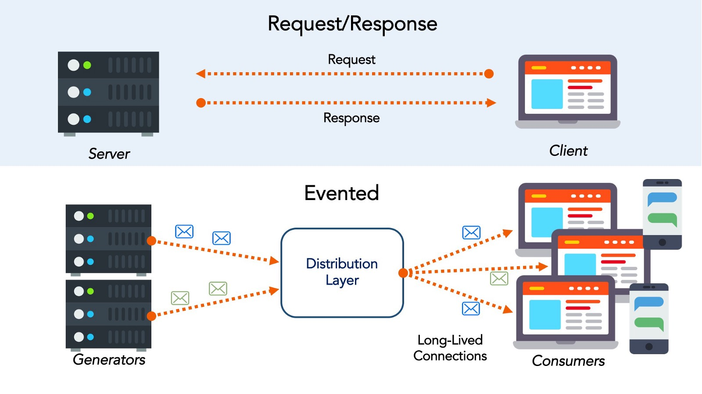
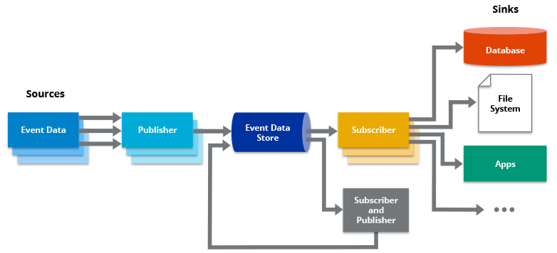
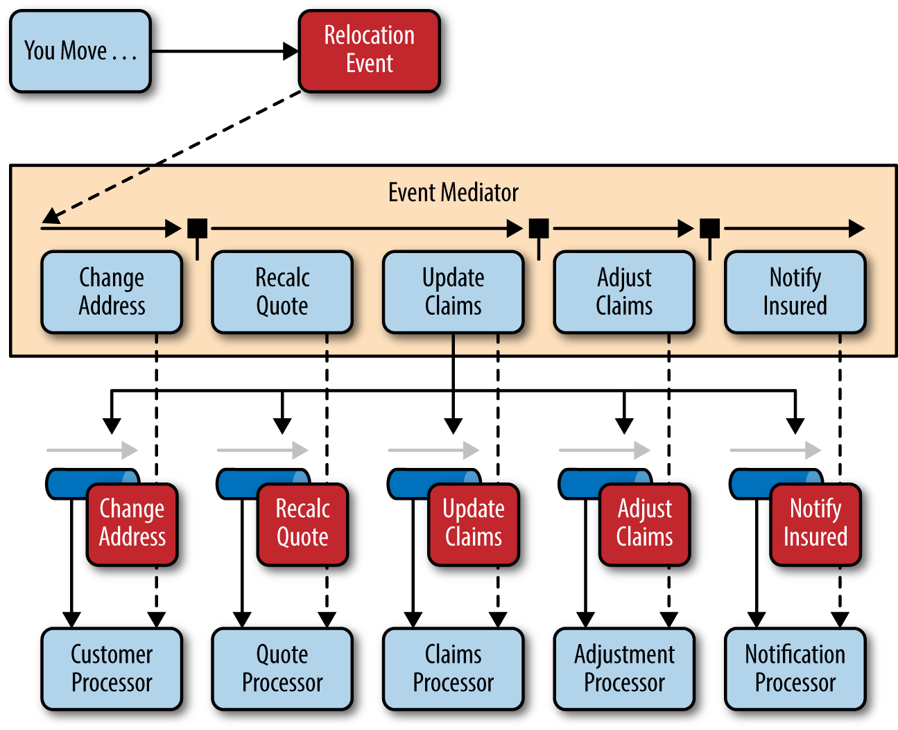
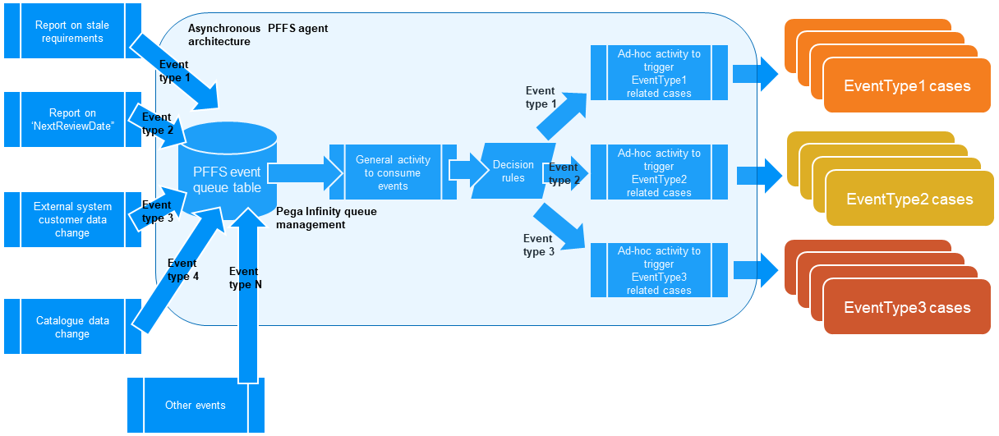

최근 기존 구조를 고도화하는 작업을 진행했습니다.

동기 처리되던 로직을 비동기로 변경하면서 EDA(Event Driven Architecture)를 도입하였습니다.

관련된 내용을 정리해보려고 합니다.

***

## EDA(Eventt Driven Architecture)란?

분산된 시스템에서 **이벤트**를 생성(발행)하고 발행된 이벤트를 수신자에게 전송하는 구조로 수신자는 그 이벤트를 처리하는 방식의 `아키텍처`입니다.

분산 아키텍처 환경에서 상호 간 결합도를 낮추기 위해 **비동기 방식으로 메시지를 전달하는 패턴**으로 주로 Message Broker(`Kafka`, `RabbitMQ`)와 결합하여 구성됩니다.

***

## EDA의 구성요소

1. **Event Generator (Publisher, Producer, Creater)**

   표준화된 형식의 이벤트를 생성(발행)합니다. 생성된 이벤트는 `Event Channel`로 전송합니다.

2. **Event Channel (Bus)**

   `Event Generator`에서 `Event Processing Engine`으로 수집된 데이터를 전파하는 메커니즘입니다.
   
   즉, 이벤트를 필요로 하는 시스템까지 발송하는 역할입니다.

3. **Event Processing Engine (Consumer, Processor)**

   수신한 이벤트를 식별/처리하는 역할을 합니다. 처리 결과에 따라 새로운 이벤트를 생성할 수 있습니다.
   
   `Consumer`는 이벤트의 송신자에 대한 정보를 알 필요가 없습니다.

***

## EDA의 동작 방식

1. Message 생성 (Publish/Subscribe)

   **이벤트**가 생성되면 `Subscriber(수신자)`에게 전달합니다. 
   
   이벤트는 반복되어 전달되지 않으며, 수신자는 송신자의 정보를 알 필요가 없습니다.

2. Event Source

   `Event Processor`에게 이벤트를 전달하는 역할을 합니다. 
   
   `Event Source`는 1개 이상일 수 있으며, 1개 이상의 `Event Processor`에게 전달합니다.

3. Event Processor

   수신된 이벤트에 대한 여러 `Action`을 수행하는 역할입니다.
   
   단일 이벤트에 대하여 타임스템프를 추가한다거나, 파생 이벤트를 만드는 등의 작업을 수행합니다.

4. Event Consumer

   이벤트에 대한 처리를 합니다. 실질적인 **Biz Logic**을 수행합니다.

### Event Processing Style

각 특징에 맞게 4가지로 구분된 Event Process Style이 있습니다.

1. Simple Event Processing

   각 이벤트가 직접적으로 수행할 `Action`과 매핑됩니다. 
   
   일반적으로 실시간 **작업의 흐름(Flow of Work)**을 처리할 때 사용합니다.
   
   처리 시간과 비용이 적습니다.

2. Event Streaming Processing

   일반적인 이벤트와 중요한 이벤트가 모두 발생하며 이를 필터링하여 수신자에게 전달합니다.
   
   일반적으로 실시간 **정보의 흐름(Flow of Information)**을 처리할 때 사용합니다.

3. Complex Event Processing

   일반적인 이벤트 패턴을 통해 복잡한 이벤트를 추론하는 방법입니다.
   
   예를 들면 일반적인 주식의 등락을 파악하여 투자할 타이밍을 추론할 수 있습니다.

4. Online Event Processing

   비동기 분산 이벤트 로그를 사용하여 복잡한 이벤트를 처리하며 지속해 데이터를 관리합니다.
   
   **높은 확정성과 일관성**을 가지며 유연하게 대처 가능한 패턴입니다.
   
   하지만 처리 시간을 보장할 수 없습니다.
   
***

## 토폴로지 구성

일반적으로 한가지 작업만 필요한 단순한 단일 이벤트일 경우에는 `Broker Topology`를

이벤트 조율이 필요한 복잡한 이벤트 플로우일 경우 `Mediator Topology`를 사용합니다.

1. **Mediator Topology (중재자 토폴로지)**

   여러 단계의 과정을 중재자를 통해 조율할 필요성이 있으면 일반적으로 사용합니다.
   
   동시에 처리하지 않거나 실행 전에 처리해야 할 요소가 있으 사용하는 토폴로지입니다.
   
   큐를 이용하여 사전처리를 진행한 후 관련된 `Consumer`에게 전달합니다.

2. **Broker Topology (브로커 토폴로지)**

   **큐나 중재자 없이** 이벤트와 응답을 직접적으로 연관시키고자 할 때 사용합니다.
   
   이벤트 플로우가 단순한 중앙집중식 토폴로지이며 `Message Broker`와 `Consumer`가 가장 중요한 요소입니다.
   
   모든 작업은 비동기로 처리되며 이벤트에 대한 조율이 필요 없습니다.

***

## EDA의 장단점

### 장점

1. Loosely Coupling
   
   분산 시스템간 **느슨한 결합도**를 제공합니다.
   
2. 분산된 시스템간 의존성 배제

   **약속된 Message를 통해 통신**하기 때문에 다른 시스템의 정보를 알 필요가 없으므로 시스템 간 의존성이 배제됩니다.

3. 확장성, 탄력성 향상

### 단점

1. Broker Dependency

   시스템 간 의존도는 낮아지지만 **메시지브로커에 대한 의존성**이 발생합니다.
   
   만약 메시지 브로커의 장애가 발생하면 큰 장애로 확산될 가능성이 있습니다.

2. Transaction 단위 분리

   장애나 이슈발생시 **Retry/Rollback**에 대한 고려가 필요합니다.

3. 시스템 Flow파악이 어려움
   
4. 디버깅이 어려움

***

## EDA를 선택할 때 고려할 특징

1. Multicast 통신

   한 개의 이벤트 `Publisher`는 다양한 `Consumer`에게 이벤트를 전달할 수 있습니다.

2. 실시간 전송

   실시간으로 발생하는 이벤트에 대한 처리가 가능합니다.

3. 비동기 통신

   비동기로 통신이 이루어지므로 `Publisher`는 처리 결과를 기다릴 필요가 없습니다.

4. 세밀한 통신

   한 덩어리의 큰 이벤트(데이터)보다 작고 자세한 이벤트로 통신이 이루어집니다.

5. 이벤트 온톨로지

   이벤트들은 확실하게 구분된 특징을 지니며 그에 상응하는 `Consumer`에게 전달됩니다.

6. 자유로운 배포

   느슨할 결합도를 제공하므로 새로운 서비스의 배포가 자유롭습니다.

***

## 요약

프로그래밍 관점뿐만아니라 다방면에서 적용가능한 아키텍처 패턴입니다.

복잡성/역동성에 가장 효율적으로 대응가능한 아키텍처입니다. 

이벤트를 통해 데이터간 연결이 생성된다는 점이 가장 중요하므로 **EDA에는 고정된 구조가 없습니다.**

***

## Reference

* [Event-Driven Architecture for Cloud-Native in Kubernetes](https://www.xenonstack.com/blog/eda-for-cloud-native-kubernetes/)

* [Introduction to Event-driven Architectures With RabbitMQ](https://blog.theodo.com/2019/08/event-driven-architectures-rabbitmq/)

* [Event-Driven Architecture](https://www.oreilly.com/library/view/software-architecture-patterns/9781491971437/ch02.html)

* [내 멋대로 구현한 이벤트 드리븐](https://jaehue.github.io/post/event-driven/#fn:3)
