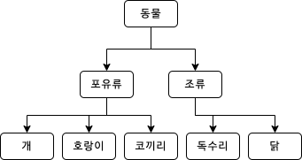

OOP에서 핵심적인 특징 중 한가지인 상속의 종류에 대하여 알아보았습니다.

***

## 상속

객체간의 계층구조를 표현하는 방법입니다.

상속을 통해 하위객체는 상위객체의 특징을 물려받습니다.



상위객체는 `부모`, 하위객체는 `자식`이라고 표현합니다.

상속은 특징을 <span class="em red">구현하는가? 사용하는가?</span> 로 구별하며, 

이 형태에 따라 크게 3가지로 구분한다.

***

## extends

**상속의 보편적인 방법입니다.**

부모가 정의/선언한 특징(_메소드, 변수_)을 `재정의`없이 그대로 사용할 수 있습니다.

**접근제한자**(_public, protected, default, private_)에 따라서 사용수준이 다르다.

**다중상속**은 언어별로 다르다. (_Java, TypeScript는 단일상속만 가능_)

이를 해결하기 위해 `implements`를 사용하는 방법이 있다.

<span class="em red">일종의 부품</span>이라고 접근하면 편하다.

### 예제

1. 일반적인 사용
   ```typescript
   class Parent {
      name: string = 'Parent'
      printName() {
         console.log(this.name)
      }
   } 

   class Child extends Parent {
      childName: string = 'Child'

      printChildName() {
         console.log(this.name, this.childName) // 상속된 자식은 부모 변수 접근가능.
      }
   }
   
   const childInstance = new Child()
   childInstance.printName() // 'Parent' ; 상속된 자식인스턴스는 부모 메소드 사용가능.
   childInstance.printChildName() // 'Parent Child'
   ```   

2. interface의 extends

   ```typescript
   interface Parent {
      name: string
      printName(): void
   }
   
   class Child extends Parent { // Error: interface는 확장할 수 없다.
   }
   ```

***

## implements

부모객체의 선언을 바탕으로 자식객체는 `재정의(Override)`하여 사용해야 합니다.

**다중상속**이 가능하다.

**정확한 의미에선 상속은 아니다.**(_Java의 폐해_)

<span class="em red">일종의 설계도</span>라고 생각하면 좋다.(_설계도를 바탕으로 전체를 구현하는 그림_)

### 예제

1. 일반적인 사용

   ```typescript
    interface ICar {
      name: string
      speed: number
      speedUp(): void
   }  
   
   class BMW implements ICar {
      name = 'BMW i9'
      speed = 0
   
      speedUp(): void {
        this.speed += 10
        console.log('Current Speed:', this.speed)
      }
   }
   
   const myCar = new BMW()
   myCar.speedUp() // 'Current Speed: 10'
   ```
   
2. Override누락 (**Error**)

   ```typescript
   interface ICar {
      name: string
      speed: number
      speedUp(): void
      speedDown(): void
   }
   
   class Audi implements ICar { // Error: Method speedDown from interface ICar is not implemented
      name = 'Audi A6'
      speed = 0

      speedUp(): void {
         this.speed += 10
         console.log('Current Speed:', this.speed)
      }
   }
   ```

3. 다중상속

   ```typescript
   interface ICar {
      name: string
      speed: number
   }
   
   interface ITruck { 
      container: number
      onTruck(): void
   }
   
   class Volvo implements ICar, ITruck {
      name = 'FH'
      speed = 0
      container = 0

      onTruck() {
        this.container += 1000
      }
   }
   ```
***

## abstract

`extends`와 `implements`를 혼합한 형태입니다.

접근제한자 `abstract`를 사용하면 `implements`처럼 재정의해야 상속이 가능합니다.

추상클래스는 **인스턴스를 생성할 수 없습니다.**

상속을 위해선 추상메소드를 반드시 구현해야 합니다.

### 예제

1. 일반적인 사용
   
   ```typescript
   abstract class A {
      a = 5
      printA() {
        console.log(this.a)
      }
      abstract printB()
   }
   
   class B extends A {
      printB() {
        this.printA()
      }
   }
   const b = new B()
   b.printA() // 5
   b.printB() // 5
   const a = new A() // Error: 추상클래스는 생성할 수 없음
   ```
   
***
