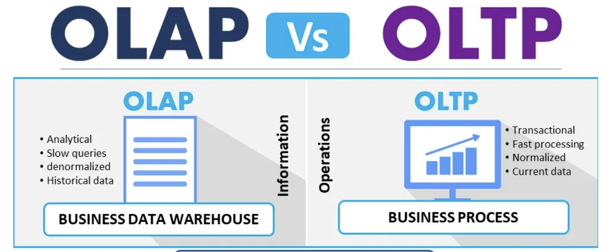

OLTP와 OLAP는 오래전부터 데이터 처리의 목적성에 따라 구분되어 사용된 용어입니다.

비슷하지만 다른 두 용어에 대해 알아보았습니다.

***

## OLTP (OnLine Transaction Processing)

네트워크상 온라인 사용자들의 요청을 처리하는 방법입니다.

사용자들의 요청을 **트랜잭션**이라고 하며, 이에 대한 CRUD 처리를 수행합니다.

따라서, `Commit`과 `Rollback` 작업이 가능해야 합니다.

수많은 트랜잭션은 Insert, Update, Delete 과정에서 **무결성이 보장**되어야 하며, 그 결과를 Select 하는 것까지를 의미합니다.

### 사용 예

1. 온라인 뱅킹에서의 사용자 요청처리 (송금, 예금 등)
2. 항공/기차 등의 티켓팅 서비스
3. e-커머스 사이트에서의 온라인 거래/주문

***

## OLAP (OnLine Analytical Processing)

OLTP와 반대로 이미 저장된 Data를 바탕으로 **유의미한 정보**를 제공하는 처리 방법 입니다.

따라서 기존에 저장된 데이터를 활용하여 처리함으로 **처리 시간 등이 보장**되어야 합니다.

### 사용 예

1. 지난 1년 간 사용자들의 항공/기차 별 예매 추이
2. e-커머스 사이트 방문 유저의 1년간 구매 제품 판매량

***

## 차이점

OLTP는 데이터 처리가 얼마나 정확하고 무결한지가 중요합니다. 즉, 요청받은 현재 **트랜잭션의 효율적인 처리에 중점**을 둔 처리 방법입니다. 따라서 컴퓨터에 더 친화적인 용어입니다.

 

반면 OLAP는 저장된 Data를 바탕으로 **어떤 정보를 추출하고 제공**하는지가 더 중요합니다. 이를 바탕으로 의사결정을 내리고 분석하는 것에 더 중점을 둔 처리 방법 입니다. 사용자에게 더 친화적인 용어입니다.

 

그러므로 OLTP가 반드시 선행되어야 OLAP가 성립됨을 알 수 있습니다.

***

## Reference

* [간략하게 정리해보는 OLTP / OLAP 의 개념](https://jins-dev.tistory.com/entry/%EA%B0%84%EB%9E%B5%ED%95%98%EA%B2%8C-%EC%A0%95%EB%A6%AC%ED%95%B4%EB%B3%B4%EB%8A%94-OLTP-OLAP-%EC%9D%98-%EA%B0%9C%EB%85%90)

* [Explain By Example: OLTP vs. OLAP](https://www.linkedin.com/pulse/explain-example-oltp-vs-olap-michelle-xie/)
