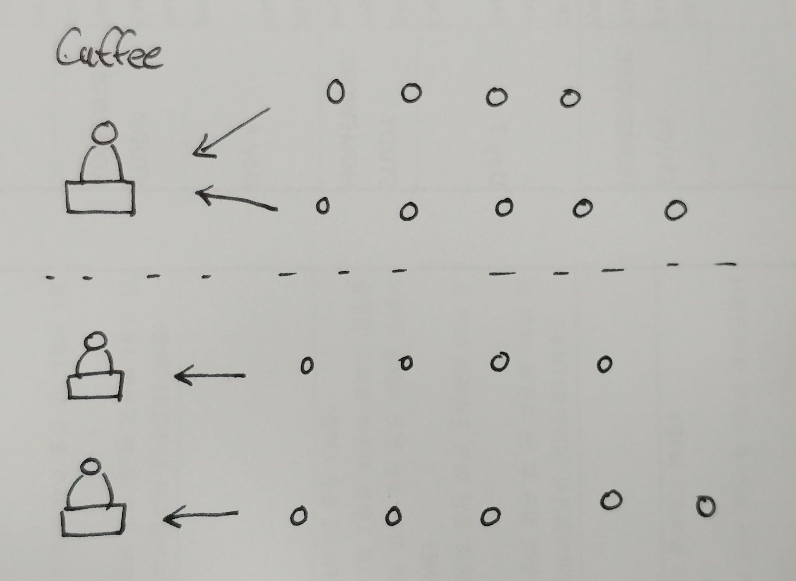

싱글 스레드기반의 프로그램들에 대한 공부를 하던 
먼저 알고 넘어가야할 중요한 개념이라 생각되어 정리를 해보았다.

***

## 동시성 (Concurrency)

1. **동시에 실행되는 것**처럼 보이는 것.

2. Time-sharing 알고리즘(시분할 등)을 이용하여 작업을 수행한다.

3. `싱글코어` 환경에서 `여러 스레드`를 처리하는 것이다.

4. 작업간 `Context Switching(문맥교환)`을 통해 자원을 공유한다.

5. **한 번에 많은 것을 처리하는 것.**

6. 논리적인 개념 (Logical)

***

## 병렬성 (Parallelism)

1. 실제로 **동시에 실행되는 것**

2. `멀티코어 환경`에서 `여러 스레드`를 처리하는 것이다.

3. **한 번에 많은 일을 처리하는 것.**

4. 물리적인 개념 (Physical)

***

## Summary

동시성있는(Concurrent) I/O를 지원한다는 것은
한 개의 컴퓨팅 유닛을 사용하여 Client들에게 동일한 플로우를 통한
작업을 처리한다는 것이다.

반면에 병렬성을 지원한다는 것은 다중 컴퓨팅 유닛을 이용하여 
**동시에** 여러가지를 처리한다는 것이다.

가장 중요한 부분은 동시성과 병렬성은 **상반적인 개념**이 아니다.
병렬성은 동시성이 필요하지만, 동시성은 병렬성을 보장하지 않는다.

***

## Reference

* [동시성(Concurrency) vs 병렬성(Parallelism)](https://seamless.tistory.com/42)
