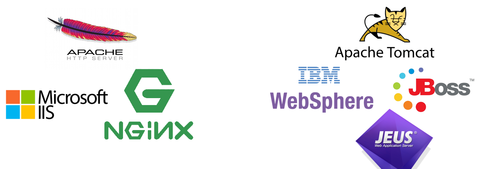
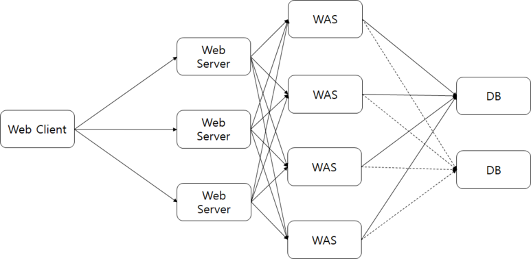

자주 헷갈리는 개념인 `Web Server`와 `WAS`의 차이점을 알아보았습니다.

***

## Web Server

`Server의 문지기`

Http요청이 들어오면 `WAS`로부터 해석된 HTML문서와 같은 웹페이지를 반환하는 역할을 합니다.

**주로 정적(Static)인 데이터를 처리합니다.**

### 종류

Apache, IIS, NginX

### 관점

웹서버는 관점에 따라 다르게 해석될 수 있습니다.

1. **H/W 측면**: 실제 물리적인 서버 장비를 의미합니다.

2. **S/W 측면**: 물리적인 서버에 설치된 프로그램을 의미합니다.

***

## WAS (Web Application Server)

**웹서버와 반대로 동적(Dynamic)인 데이터를 처리합니다.**

실제로 Application이 동작하는 부분으로 대게 `웹서버`와는 구분이 됩니다.

실질적인 **비즈니스 로직**과 **DB 작업**들이 수행되는 곳입니다.

### 종류

Tomcat, Web logic, Jeus

***

## Web Server와 WAS를 분리하는 이유

### Web Server의 존재 이유

웹서버는 정적인 데이터를 주로 처리하는 역할을 합니다.

요청에 좀 더 빠른 응답을 할 수 있으며, Application의 부하를 줄일 수 있습니다.

### WAS의 존재 이유

대부분의 웹페이지는 정적/동적인 데이터가 모두 존재합니다.

`WAS`는 실질적인 비즈니스 로직이 동작하며 동적인 데이터를 다루는데 이것을 모두 `웹서버`에서 처리하기엔 자원 낭비가 심합니다.

따라서 Application이 동작하고 동적인 데이터를 다루면서 효율적인 자원관리를 할 수 있습니다.

### 두 서버의 분리 이유

1. 서버 부하 방지

   모든 데이터(동적, 정적)를 한 서버에서 모두 처리하기에는 H/W 자원은 한정되어 있습니다.

   기능을 분리하여 관리하는 측면이 좀 더 빠른 응답을 제공할 수 있습니다.

2. 보안 강화

   외부로부터의 접근을 막아 서버 환경에 대한 노출을 방지할 수 있습니다.

3. 다양한 WAS 환경 제공

   웹서버가 로드밸런서 역할을 하여 다양한 `WAS`와 연결할 수 있습니다.

   성격이 다른 Application들을 동시에 제공할 수 있습니다.

`WAS`는 정적/동적인 데이터를 모두 다룰 수 있는 서버입니다. 또한 눈에 띄는 성능저하도 발생하지 않기 때문에 `웹서버`가 없어도 페이지를 제공하는 데 어려움이 없습니다.

하지만 다양한 환경의 Application 활용을 위해 로드밸런서로서의 역할은 큰 도움이 됩니다.

***

## Web Server Architecture

1. Client -> Webserver + DB
   
   
   
2. Client -> WAS -> DB

   

3. Client -> Webserver -> WAS -> DB

     

*** 

## Reference

* [[Web] Web Server와 WAS의 차이와 웹 서비스 구조](https://gmlwjd9405.github.io/2018/10/27/webserver-vs-was.html)

* [WAS 와 웹 서버 차이 (WAS,Web Server) 그리고 아파치, 톰캣](https://jeong-pro.tistory.com/84)
