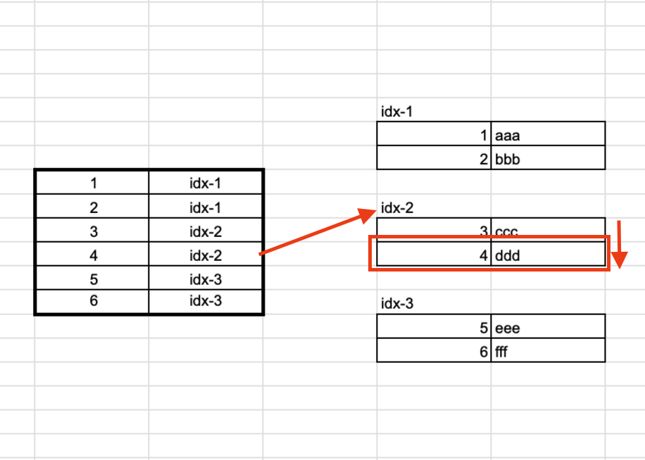
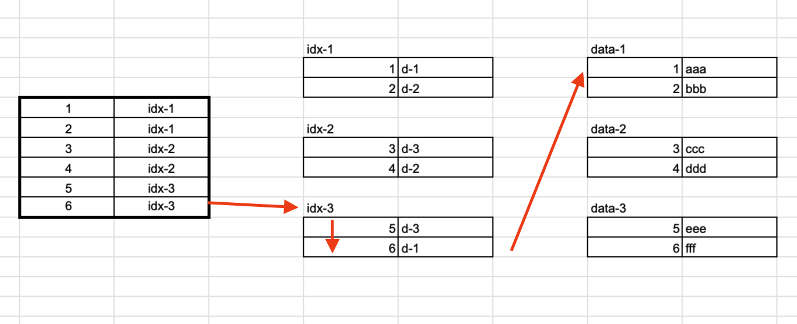

인덱스를 간단하게 살펴보고 클러스터 인덱스와 넌 클러스터 인덱스를 알아보았습니다.

***

## Index란?

추가적인 **쓰기**와 **저장공간**을 사용하여 Database 테이블의 **검색속도**를 높여주는 자료구조입니다.

**CUD 작업**(`Insert`, `Update`, `Delete`)은 기본적으로 **R 작업**(`Select`)을 선행하기 때문에 

효율적인 인덱스의 사용은 테이블의 CRUD 작업의 성능을 높여줍니다.

인덱스로 설정되지 않은 컬럼의 조회는 `Full Scan`수행하기 때문에 속도 저하를 가져옵니다.

***

## 특징

최신화된 Index는 성능향상을 보장하지만 인덱스가 적용된 컬럼에 CUD 작업이 발생한다면 **Overhead가 발생**합니다.

1. **INSERT** (C)

    새로운 데이터에 대한 인덱스를 추가합니다.

2. **DELETE** (D)

    삭제되는 데이터에 대한 인덱스를 제외처리 합니다.

3. **UPDATE** (U)

    기존 인덱스는 제외처리, 새로운 데이터에 대한 인덱스를 추가합니다.

### 장점

**조회(Read) 속도뿐만 아니라 전반적인 성능향상을 기대할 수 있습니다.**

모든 **CUD 작업**(`Insert`, `Update`, `Delete`)은 기본적으로 **R 작업**(`Select`)을 선행하기 때문에 

연관되는 대부분의 작업에서 성능개선을 기대할 수 있습니다.

따라서 **전체적인 시스템 부하 역시 줄일 수 있습니다.**

### 단점

**추가적인 저장공간이 필요합니다.**

인덱스란 결국 별도의 페이지를 생성하는 작업이기 때문에 자연스럽게 저장공간이 필요합니다.

또한, 잘못된 사용이나 무분별한 사용(남/오용)은 **성능 저하라는 역효과를 가져옵니다.**

위에서 설명한 특징들 때문에 인덱스의 크기는 점점 증가하기 때문입니다.

### 주의점

1. 데이터의 중복도가 낮은 컬럼(카디널리티가 낮은)을 기준으로 생성하도록 합니다.

2. `Join`, `Where`, `Order by`조건이 자주 사용되는 컬럼을 기준으로 합니다.

3. **CUD 작업**이 빈번하지 않는 컬럼을 기준으로 합니다.

4. 사용하지 않는 인덱스는 반드시 제거합니다.

***

## 클러스터 인덱스 (Cluster Index)

테이블당 1개 생성할 수 있는 인덱스입니다.

테이블 생성 시 **Primary Key(PK)**를 지정하면 자동으로 클러스터 인덱스가 생성됩니다.

생성 시 인덱스는 열(Column) 단위로 생성되며, 지정한 열에 대하여 페이지 전체를 물리적으로 다시 정렬합니다.

Root페이지와 Leaf페이지로 구성되며, Root페이지는 **Leaf페이지의 주소**가 Leaf페이지는 **실제 데이터 페이지** 입니다.

읽기 속도는 향상되지만 쓰기/수정의 속도는 상대적으로 느립니다.

### 장점

1. `MAX`, `MIN`, `COUNT`등의 쿼리로 **범위 또는 Group By** 등의 조회를 할 때 이상적입니다.

2. 조회 시 특정 지점(인덱스의 키가 지정하는)으로 바로 찾기 때문에 효율적입니다.

3. 페이지 전송을 최소화하고 캐시 히트를 극대화 할 수 있습니다.

### 단점

1. 데이터 페이지 뿐만 아니라 인덱스 페이지의 파편화 현상이 발생합니다.

2. `Insert`, `Update`, `Delete`를 위한 추가작업이 발생합니다.

3. 생성/변경 등이 발생할 때 오랜 시간이 걸립니다. 

***

## 넌클러스터 인덱스 (Non-Cluster Index)

테이블당 여러 개 생성할 수 있습니다.

이미 **Primary Key(PK)**로 지정되어 있더라도 강제적으로 넌클러스터드 인덱스를 지정할 수 있습니다.

데이터 페이지는 따로 존재하며 별도의 **인덱스 페이지**를 생성합니다.

Root페이지는 Leaf페이지의 주소를 저장하며 Leaf페이지는 데이터 페이지의 실제 데이터 주소를 저장하는 **포인터**입니다.

 

> 테이블 생성 시에 인덱스를 생성하기 위해선 제약조건이 필요합니다. 기본 제약조건은 PK와 UNIQUE뿐입니다. 

### 장점

1. 데이터를 신속하게 찾을 때 큰 도움이 됩니다.

2. 클러스터 인덱스와 연관된 오버헤드를 줄이는데 도움이 됩니다.

3. 하나 이상의 인덱스 생성을 통해 성능향상을 기대할 수 있습니다.

### 단점

1. 논리적인 정렬을 지원할 뿐, 물리적인 정렬이 발생하지 않습니다.

2. 인덱스 조회 시 비용이 많이 발생합니다.

3. 클러스터 인덱스의 변경이 발생할 때 그에 상응하는 업데이트가 발생합니다.

***

## 요약

1. 클러스터 인덱스는 키 기반으로 테이블 데이터를 정렬하지만, 넌클러스터 인덱스는 데이터는 따로 저장되며 그 위치만을 인덱싱합니다.

2. 클러스터 인덱스는 인덱스의 Leaf페이지에 실제 데이터를 저장하지만, 넌클러스터 인덱스는 데이터를 저장하지 않습니다. 

3. 클러스터 인덱스는 추가적인 저장공간이 필요없지만, 넌클러스터 인덱스는 추가 저장공간이 필요합니다.

4. 클러스터 인덱스는 데이터 접근 속도가 빠르지만, 넌클러스터 인덱스는 상대적으로 느립니다.

***

## Reference

* [Clustered vs Non-clustered Index: Key Differences with Example](https://www.guru99.com/clustered-vs-non-clustered-index.html)

* [인덱스(클러스터, 비클러스터) 개념](https://mongyang.tistory.com/75)

* [클러스터드 인덱스와 넌 클러스터드 인덱스](https://lng1982.tistory.com/144)

* [클러스터/넌클러스트 인덱스 (cluster index/noncluster index)](https://swconsulting.tistory.com/381)
