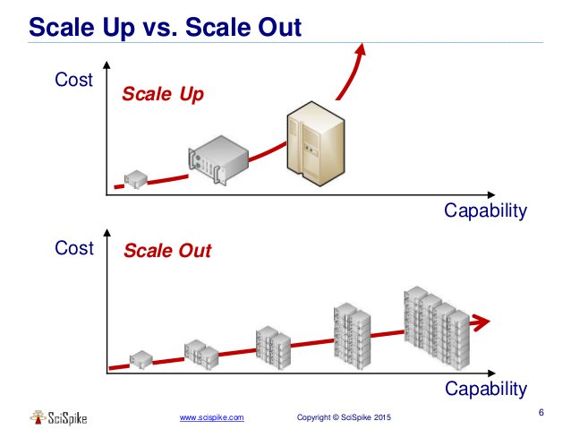

다양한 환경에서 서버 구성을 하다 보면 늘어나는 접속자 또는 처리량에 따라 **스케일링(Scaling)** 을 고려해야 하는 상황이 옵니다.

스케일링에 있어 대표적인 두 가지를 비교해보았습니다.

***

## Scale Up (스케일 업)

기존 서버의 **성능 자체를 올리는 작업**입니다.

Disk의 증설(저장공간의 추가), CPU/Memory 등의 추가 또는 성능 업그레이드 등을 통해 서버 한 개의 능력을 향상하는 방법입니다.

`수직 스케일링(Vertical Scaling)`이라고도 합니다.

### 특징

1. 추가적인 **네트워크 구성**이 필요 없습니다.
2. 성능 향상에는 물리적 **한계**가 있습니다.
3. 상황에 따라 **서비스 다운타임(Donw time)** 이 발생할 수 있습니다.
4. 빠르고 정확한 처리가 필요한 `OLTP` 환경에서 효율적입니다.

***

## Scale Out (스케일 아웃)

Scale Up과 다르게 서버를 **추가, 확장하는 작업**입니다.

서버의 처리능력이 한계에 도달했을 때 비슷한 성능의 서버를 추가합니다.

다수의 서버가 부하를 분담하여 처리하기 때문에 **분산 병렬처리**와 유사합니다.

추가/확장 개념에서 `수평 스케일링(horizontal Scaling)`이라고도 합니다.

> 대부분의 클라우드서비스에서는 **스케일 아웃**을 기본으로 오토스케일링(Auto-Scaling)을 지원합니다.

### 특징

1. 기존 운영 중인 서버에 영향이 없기 때문에 **안정성**이 높습니다.
2. 서버가 늘어나므로 로드 밸런싱 등의 **아키텍처** 고려가 필요합니다.
3. 서버의 증가는 **관리 포인트의 증가**를 의미합니다.
4. 대량의 데이터와 복잡한 쿼리 수행을 위한 `OLAP` 환경에 적합합니다.

***

## Reference

* [Scale-up과 Scale-out에 대해 알아보자!](https://tecoble.techcourse.co.kr/post/2021-10-12-scale-up-scale-out/)

* [OLTP와 OLAP](https://akasai.space/basic/about-oltp-olap)
