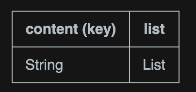
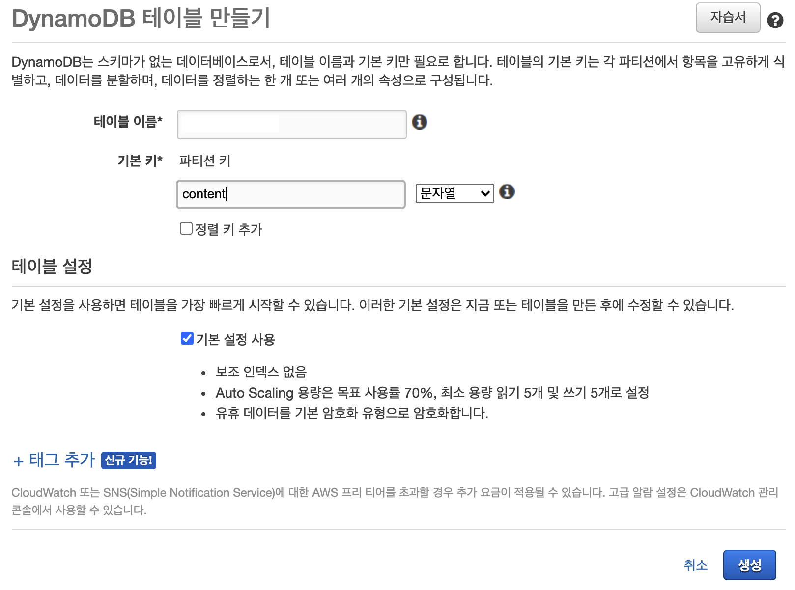
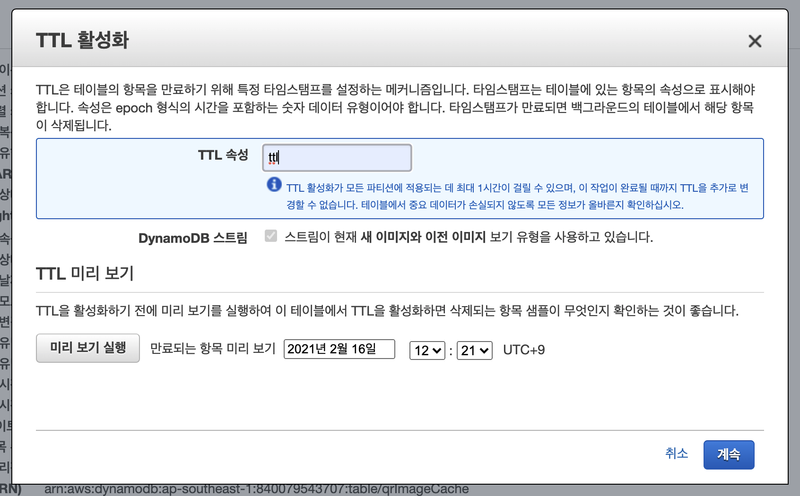
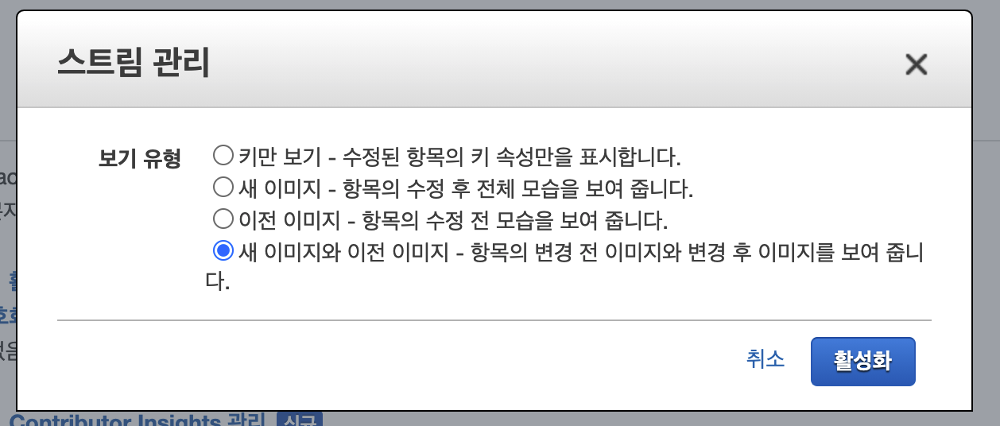
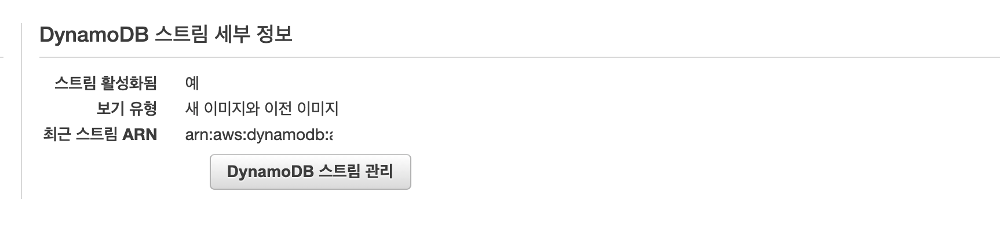
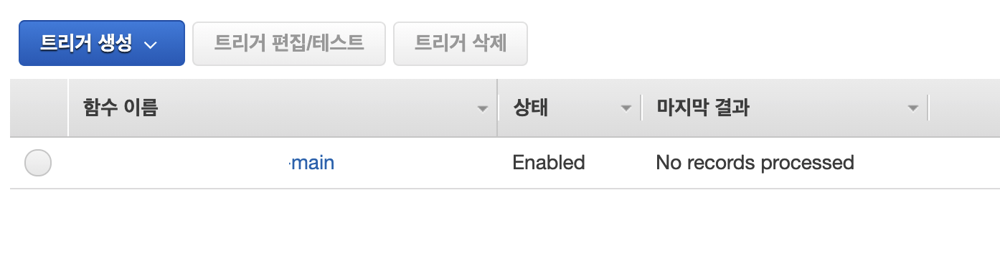
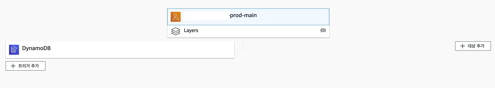

주기적으로 캐싱을 해야 하는 작업이 있어 삽질해본 경험을 공유하려 합니다.

단순하게 Crontab이나 배치 등을 이용하여 처리하는 방법과

Request 단위로 캐싱을 하는 방법을 생각해보았지만, 여러 조건이 존재해서 아래 방법을 선택했습니다.

***

## Data Modeling

기존 API의 latency를 줄이기 위한 일부 데이터를 캐싱하는 작업이였기 때문에 스키마를 복잡하게 모델링하진 않았습니다.

키를 기준으로 Map을 요소로하는 List를 구성하였습니다.



***

## Storage 

일반적으로 캐싱이라면 NoSQL을 통해 처리하고 있고 현업에서는 `'Redis`, `DynamoDB`를 사용하고 있습니다.

구상하고 있는 스키마에 적합한 것은 `DynamoDB`라고 판단했습니다.

Redis 역시 다양한 dataType을 지원하지만 **Map을 요소로 하는 List**를 구성하기엔 DynamoDB가 적합하다고 생각했습니다.

***

## TTL (Time To Live)

Crontab또는 배치를 사용하지 않고 어떻게 주기적으로 캐싱을 할 것인지가 중요한 포인트였습니다.

Redis와 DynamoDB 둘 다 TTL 기능을 지원하고 있습니다.

Redis는 TTL에 대한 evnet를 Subscribe 하는 추가적인 개발이 필요했지만 DynamoDB는 `Stream Trigger`를 이용해 `Lambda`를 호출할 수 있습니다.

이런 이점들을 고려하여 최종적으로 DynamoDB를 선택하여 개발을 시작했습니다.

***

## DynamoDB 세팅

1. 일반적인 세팅과 같이 AWS Console에서 테이블 세팅을 합니다.



2. 테이블이 생성되면 TTL로 설정하고자 하는 Attribute를 입력한 뒤 TTL을 설정합니다.

   TTL은 반드시 Number타입으로 세팅되어야 합니다.



3. Stream 세팅을 통해 `ARN`을 획득합니다.

  스트림에는 총 **4가지 타입**이 존재합니다.

   1. 키만 보기

      DynamoDB의 **키(HachKey/SortKey)값**만 Stream으로 전송합니다.

   2. 새 이미지

      새롭게 수정된 레코드 내용을 Stream으로 전송합니다.

   3. 이전 이미지 
      
      기존 레코드 내용만 Stream으로 전송합니다.

   4. 새 이미지와 이전 이미지

      변경된 내용과 이전 내용이 모두 Stream으로 전송됩니다.



4. 생성된 ARN을 바탕으로 Lambda트리거 세팅을 합니다.



***

## Lambda 세팅

[Serverless Framework](https://www.serverless.com/)를 통해 환경 세팅을 했습니다.

배포하면 자동으로 관련된 Role을 생성해주기 때문에 Console 내 작업은 더 이상 하지 않았습니다.  

1. serverless.yml 세팅

```yaml
  functions:
  main:
    handler: main.handler
    events:
      - stream:
          arn: arn:aws... # 뒤쪽 타임스탬프까지 모두 입력
          type: dynamodb
          batchSize: 100
    memorySize: 256
    timeout: 180 
```

2. Serverless Framework에서 제공하는 플로우대로 배포를 합니다.
   
   배포 완료 후 Console을 통해 확인하면 DynamoDB와 연결된 내용을 확인 할 수 있습니다.

**DynamoDB의 트리거**



**Lambda의 트리거**



3. 위와 같이 세팅이 완료되면 준비는 끝났습니다.

이후 DynamoDB의 레코드에 특정 이벤트가 발생하면 Lambda함수로 Event가 전송됩니다.

```json
{
  Records: [
    {
      eventID: '...',
      eventName: 'INSERT',
      eventVersion: '1.1',
      eventSource: 'aws:dynamodb',
      awsRegion: '...',
      dynamodb: {
        ApproximateCreationDateTime: 1613373723,
        Keys: { content: { S: '테스트' } },
        NewImage: { ttl: { N: '1613373820' }, content: { S: '테스트' } },
        SequenceNumber: '4500000000033167407696',
        SizeBytes: 41,
        StreamViewType: 'NEW_AND_OLD_IMAGES'
      },
      eventSourceARN: 'arn:aws:...'
    },
    {
      eventID: '...',
      eventName: 'REMOVE',
      eventVersion: '1.1',
      eventSource: 'aws:dynamodb',
      awsRegion: '...',
      dynamodb: {
        ApproximateCreationDateTime: 1613373723,
        Keys: { content: { S: '테스트' } },
        NewImage: { ttl: { N: '1613373820' }, content: { S: '테스트' } },
        SequenceNumber: '4500000000033167407696',
        SizeBytes: 41,
        StreamViewType: 'NEW_AND_OLD_IMAGES'
      },
      eventSourceARN: 'arn:aws:dynamodb:...'
    },
    ...
  ]
}
```

Record는 배열이며 동시간대 발생하는 다수의 이벤트들이 함께 들어옵니다.

**eventName객체**는 `INSERT`, `REMOVE`, `MODIFY` 등이 있으며, **dynamodb객체**에 실제 레코드 정보가 담겨 있습니다.

***

## 주의점

무작정 TTL의 장점만을 보고 사용하기에는 주의해야 할 사항들이 존재합니다.

1. TTL 속성에 숫자 데이터 형식을 사용해야 합니다. 다른 데이터 형식(예: 문자열)은 지원되지 않습니다.
   
2. TTL 속성은 Epoch 시간 형식을 사용해야 합니다.

    ```json
    Linux Terminal: date +%s

    Python: import time; int(time.time())

    Java: System.currentTimeMillis() / 1000L

    JavaScript: Math.floor(Date.now() / 1000)
    ```

3. DynamoDB가 항목을 삭제할 때까지 최소 48시간 동안 기다립니다.
   
4. 만료 날짜는 5년을 넘지 않아야 합니다.

**Lambda로 전송된 스트림은 온전하게 끝나지 않는다면 Failover를 계속 수행합니다.**

**이는 장점이 될 수도 있지만, 무한실행이라는 치명적인 오류를 가져옵니다.**

적절한 Lambda함수 처리가 필요합니다.

***

## Reference

* [DynamoDB TTL](https://docs.aws.amazon.com/amazondynamodb/latest/developerguide/TTL.html)

* [TTL 특징](https://aws.amazon.com/ko/premiumsupport/knowledge-center/dynamodb-ttl-items-not-deleted/)
