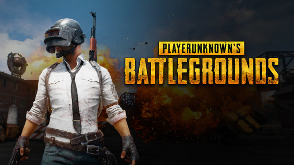
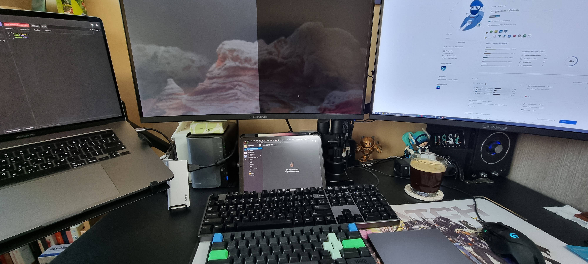
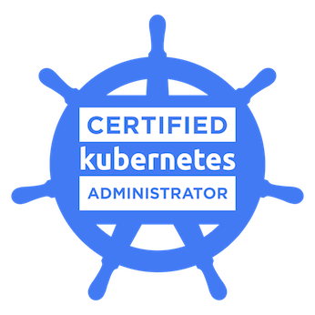
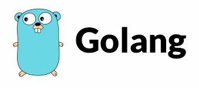

블로그를 새로 만들고 나서 **첫 번째 회고**인 것 같다.

기념으로 미디엄에 썼던 예전 회고를 읽어 보았는데, 다시 쓰려니 감회가 새롭다.

발버둥 치던 2021년이 끝나고 벌써 2022년의 1월도 절반이 지나갔다.

달마다 간단한 느낌이나 생각을 정리해봤는데, 이걸 바탕으로 뒤늦은 회고를 적어본다.

***

## 이직

> 이직을 결심했다.

### 왜?

많은 개발자가 이직할 때 다양한 관점으로 생각하고 결정하리라 생각한다. 나도 비교적 편해진 직장에서 이직을 결정하게 된 여러 가지 요인들을 생각해보았다.
  
첫 번째는 위에서 말한 **편해짐**이다. 편해질대로 편해져서 나의 발전에 채찍질할 원동력이 없었다. (_물론 핑계다._)
  
두 번째, **시니어의 부재**다. 난 아직 시니어급의 개발자는 아니기 때문에 좀 더 배우고 싶은 욕구가 있었다. 하지만 팀 내에 시니어 개발자가 없어서 내가 하는 작업이 맞는 건지? 더 나은 개선 방향이 있는지? 등의 조언을 얻을 기회가 없었다. **답을 바라는 게 아닌 방향성 정도의 조언을 얻고 싶었다.**
  
세 번째, **인사이트**를 넓히고 싶었다.  뛰어난 주니어 개발자와 시니어 개발자의 차이는 경험치의 차이가 아닐까? 개발실력은 시간이 지날수록 평준화된다고 생각한다. 더 넓은 영역에서 더 많은 경험치를 얻기에는 제한적인 서비스를 하는 스타트업에서는 쉽지 않다고 판단했다.
  
마지막으로 의지했던 **동료개발자의 이직**이었다. **사실 이게 가장 컸던 것 같다.**

### 첫 합격

나름의 논리적 근거를 바탕으로 2020년 하반기부터 이직 준비를 꾸준히 했다.

재직했던 회사에서 큰 프로젝트의 배포를 앞두고 있었기 때문에 학습과 준비를 병행하는 게 정말 어려웠다. 이런 이유로 공격적인 접근이 아니라 적당한 시간과 텀을 두고 지원할 회사를 찾으며 준비를 이어갔다.
  
그러던 2020년 10월, 평소에 관심이 있었던 `PUBG(현, 크래프톤)`의 안티치트 백오피스 서버개발 부분에 합격했다. 기술 스택도 맞았고 관심 있었던 분야였지만, 금전적 부분은 수용하기 힘들었다. (_나이와 미래를 고려하면..._)

더 나은 기회가 있을 거라 생각하여 입사를 포기하였다.

### 탈락의 연속

적당히 짬밥을 먹고 나면 그렇듯.. (_나만 그랬을지도?_), 현재 내 수준에 만취하여 눈이 높아지고, 현실을 직시하지 못했던 것 같다.
한 군데 한 군데 면접을 보면서 느꼈던 것은 나에 대한 반성과 더 열심히 못 한 후회뿐이었다. (_그냥 펍지갈껄..._)
  
운이 좋은 건지 서류는 곧잘 합격했지만 고질병이었던 **코딩테스트**에서 자주 탈락했다. 단기간에 성장할 수 없는 부분이라고 생각되어 문제 풀이를 통한 학습을 하였고 미세하게나마 합격률은 올라갔다.
면접 질문들을 통해 내 수준과 한계를 경험했고 복기를 통해 계속 공부하면서 시도했다. 아마 이때부터 내 기술 스택의 바운더리가 좁다고 생각돼서 `코틀린(Kotlin)`도 조금씩 공부했다.
**아마.. 이때가 가장 우울하고 자존감이 떨어졌던 시기가 아니였나 싶다.**
  
그리고 첫 합격 이후 거의 7개월간의 방황과 도전 끝에 **새 직장에 합격하였다.**

***

## 퇴사 그리고 새 직장

> 3년 6개월의 재직, 이직을 준비한 지 만 1년. 퇴사했다.

입사 전, 못 봤던 사람들, 여행 그리고 휴식 순식간에 한 달이 사라졌고 입사 준비를 해야 했다.

### 원격근무

`직방`은 원격근무를 기본으로 한다. 단순한 재택근무를 넘어서 **출근할 사무실조차 없다.** 짧은 사회생활을 돌이켜봐도 정말 생소한 근무환경이었다.

> 온 보딩을 어떻게하지?
 
원격근무로 채택한 지 오래되지 않았기 때문에 아직은 체계적인 프로세스가 있지 않았다. 시행착오도 있었지만, 생각보다 순조롭게(?) 회사 생활에 적응할 수 있었다.

7개월이 지난 지금은 이 프로세스가 아니면 어색할 정도로 적응을 해버려서 걱정이다.

_여담이지만, 아직 실제로 만나지 보지 못한 팀원도 있다._

### 만족도

위에서 언급했던 **이직의 사유를 충족할 수 있는 분위기의 팀**이다. 사실 회사의 매출, 방향성, 미래, 비전 등등 복잡한 부분은 생각하기 귀찮다.
물론 혹자에겐 중요한 요소일 수 있지만 내가 이직하고자 했던 목적과 목표가 있었기에 단순하게 생각하고 싶다.

새로운 환경과 새로운 업무에 적응하느라 긴장하며 학습했고, 내 생각을 공유하고 조언받을 수 있는 든든한 팀원과 시니어가 있고, 더 민감하고 큰 서비스를 통해 내 인사이트를 넓힐 수 있다.
  
**부족한 점도 분명 존재한다.** 모든 것을 충족할 수 있는 곳은 없기에, 이 정도로 충분히 만족하며 개발하고 있다.
_내 하찮은 실력이 도움이 되길 바랄 뿐이다._
  
빠른 스프린트 템포 덕분에 쉴 틈 없이 일하고 있다. (_야근을 빡세게 하는 건 아니기 때문에 타협할 수 있다!_)
  
회사 블로그에 글도 올렸다. 벌써 7개월이 지났다는 게 믿기지 않지만 앞으로가 더 기대된다.

> [**직방 기술블로그:테스트 좋아하세요?**](https://medium.com/zigbang/%ED%85%8C%EC%8A%A4%ED%8A%B8-%EC%A2%8B%EC%95%84%ED%95%98%EC%84%B8%EC%9A%94-d14d84778ff9)

***

## 공부

가장 일을 많이 하는, a.k.a 가장 잘 팔리는, 연차에 접어들었다.

다른 관점으론 미래에 대한 방향성을 결정해야 할 시기라고 생각한다.

그래서 고민이 많다. 물론 어느 정도 청사진을 그리고 있기에 공부도 꾸준히 하고 있다.

(_이 정성과 노력이면 서울대를 갔을텐데..._)

1. **알고리즘**

   말해 뭐할까?

2. **CKA**

   작년부터 조금씩 준비해왔다. 진행도가 느려 이러다간 이도 저도 안될 것 같아서 Cyber Monday할인으로 시험을 먼저 결제했다. 빼박이다.

   하루에 한 줄이라도 매일 공부하려 한다.

   

3. **GO**

   새로운 언어를 공부해보려 한다. Python이 제일 핫 하지만 난  Go를 선택했다. 알고리즘이랑 같이 조금씩 해보고 있다.

   

***

## 2022년은?

`백엔드 개발자`보다 `DevOps 엔지니어` 쪽에 무게를 더 두고 공부를 할 것 같다.

예전 회고를 읽어보니 거창하게 하고 싶은 내용을 나열했는데 지금 와서 생각하면 달성한 게 없다.

현실을 직시하고 작년에 목표했던 것만 다 이루는 한 해가 되면 좋겠다.

### 2022년 목표

1. 월말 회고 적어보기
2. 기본 이론 확실히 하기
3. 알고리즘 능숙해지기
4. CKA 취득
5. GoLang 중급이상 (_기준이 모호하지만_)
6. 회사던 공부던 하던거 잘하기
