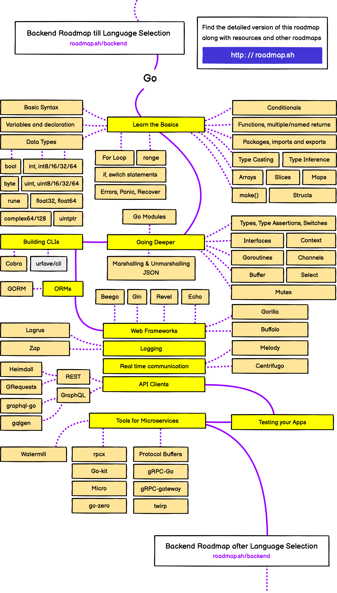
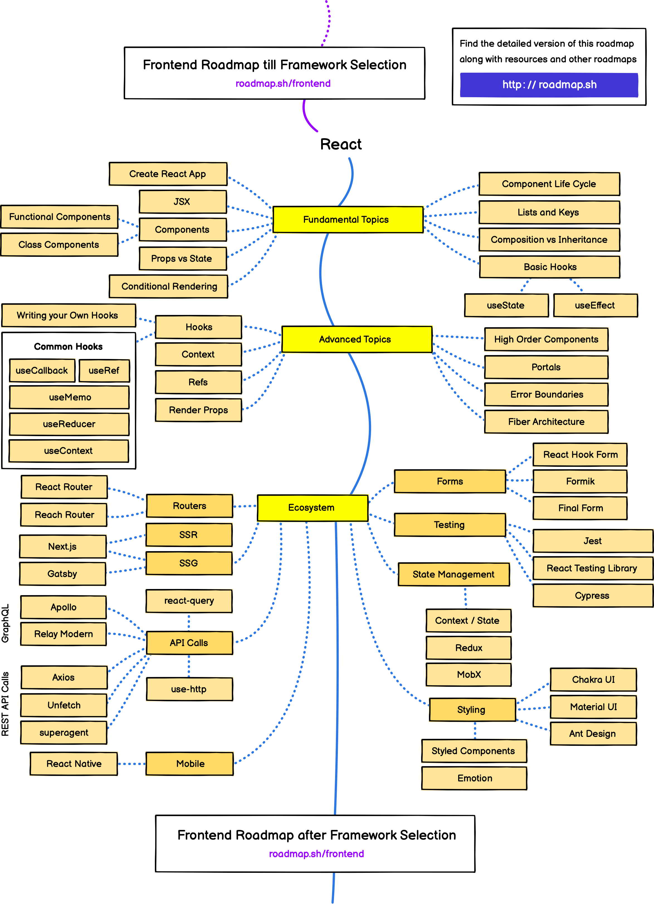

2022년 버전이 새로 업데이트 되어 포스팅해본다.

아직 한글버전은 준비되지 않은 것 같다.

기존 페이지가 많이 업데이트 되서 백엔드는 이미지가 아니라 서비스형태로 변경되었다.

최근에 GoLang공부를 시작하게 되어 GoLang 로드맵과 프론트엔드도 같이 포스팅 해본다.

***

## 백엔드 개발자

***

## 데브옵스 개발자

***

## Golang 개발자

***

## 프론트엔드 (리액트) 개발자

*** 

## Reference

* [Developer Roadmaps](https://roadmap.sh/)

* [Github](https://github.com/kamranahmedse/developer-roadmap)

