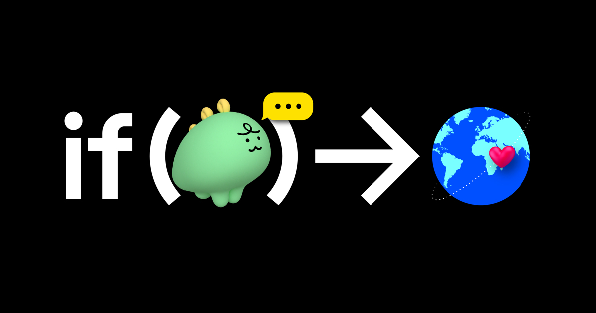
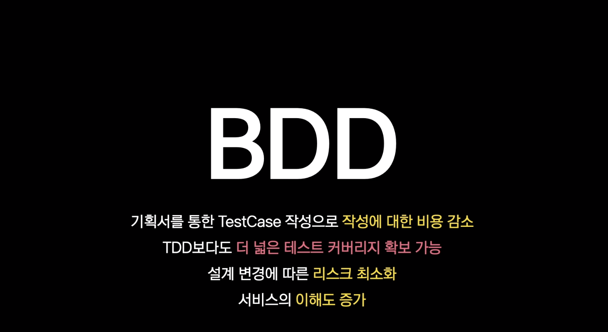

***

## if(Kakao) 2020

매년 카카오에서 진행하는 개발자 컨퍼런스이다.

추첨을 통해 제한된 인원만 참석할 수 있었는데, 올해는 언택트로 진행되어 너무 편하게 참여할 수 있었다.

기분탓인지 모르겟지만 오프라인때보다 더 많은 세션이 준비된 것 같아서 알찬느낌이었다.

간략하면서 허술하게 시청했던 내용들을 정리해보려 한다.

***

## Session

세션들을 대략적으로 살펴만 봐도 올해 Kakao의 방향성이 느껴졌다.

백엔드관련 세션들의 대부분이 **DevOps**와 관련된 내용이였고 특히 `쿠버네티스`를 활용한 부분들이 매우 인상 깊었다.

평소에도 관심이 있었고 조금이나마 운용하고 있는 상황인지라 더 흥미로웠던 것 같다.

### 카카오톡 4M/s 캐시 클러스터 전환기

> [Session Link](https://tv.kakao.com/embed/player/cliplink/414132080?service=kakao_tv&section=channel&profile=HIGH&wmode=transparent&popup=1&autoplay=1) 

> [Kakao Tech: Commentary](https://tech.kakao.com/2020/11/10/if-kakao-2020-commentary-01-kakao)

**Redis와 K8s**, 섬네일만으로도 끌렸던 세션이다. 

캐시 클러스터 전환에 대한 경험을 공유하는 세션이였다.

너무 방대한 규모라서 감은 잘 안잡혔지만 큰 흐름이나 방향성은 충분히 이해할 수 있는 발표였다.

무엇보다 모든 워스트케이스의 결말이 같았다는 점이...

### Programming Kubernetes Controller

> [Session Link](https://tv.kakao.com/embed/player/cliplink/414072325?service=kakao_tv&section=channel&profile=HIGH&wmode=transparent&popup=1&autoplay=1)

쿠버네티스에 대한 내용을 대략적으로 설명해주고 이를 활용한 개발기를 공유하는 세션이었다.

카카오에서 개발하는 `쿠버네티스 아키텍처`에 대한 설명과 함께 간단한 구현방법, 구조 등에 대한 설명이 함께 진행됬다

### 엔터프라이즈 환경에서의 ITSM 을 고려한 Kubernetes 도입

> [Session Link](https://tv.kakao.com/embed/player/cliplink/414072321?service=kakao_tv&section=channel&profile=HIGH&wmode=transparent&popup=1&autoplay=1)

카카오의 쿠버네티스 인프라 DKOS를 간단히 소개하고 ITSM을 고려한 K8s도입 전략에 대하여 설명한다.

내가 직접해본 것은 아니지만 개인적으로 짧지만 임팩트 있었던 세션이었다.

### Terraform을 사용해보았습니다. 나 혼자만 beanstalk

> [Session Link](https://tv.kakao.com/embed/player/cliplink/414072246?service=kakao_tv&section=channel&profile=HIGH&wmode=transparent&popup=1&autoplay=1)

카카오페이지에서 `Terraform`을 사용하게된 이유와 인프라를 구성한 경험에 대한 세션이었다.

Terraform을 자주들어 익숙했지만 사용해본 적이 없었기 때문에 대략적인 내용만 파악할 수 있었지만

조금 더 공부하고 본다면 큰 도움이 될 것 같았다.

### kotest가 있다면 TDD 묻고 BDD로 가!

> [Session Link](https://tv.kakao.com/embed/player/cliplink/414004682?service=kakao_tv&section=channel&profile=HIGH&wmode=transparent&popup=1&autoplay=1)

개인적으론 상당히 인상깊었다. `BDD`를 도입한 경험을 공유하는 세션이었다. 

TDD를 도입하려 노력도 많이 했고 완벽하진 않지만 도입해본 경험을 바탕으로 들어보니

상당히 매력적인 방법론이었다.

기회가 된다면 좀 더 공부하고 시도해보면 좋을 것 같다.

***

## 요약

운좋게 매년 if kakao를 참석했지만, 올해가 가장 만족스러웠다.

언택트로 진행되서인지 오프라인보다 세션수도 훨씬 많았고,

여러 세션중에 선택했어야 했던 오프라인과 달리 원하는 세션을 마음껏 들을 수 있었다.

내용들도 매력적인 주제가 많아서 두고두고 봐도 괜찮을 것 같다.

***

## Reference

* [if Kakao 2020](https://if.kakao.com)

* [Kakao TV - 다시보기](https://tv.kakao.com/channel/3693125/video)
