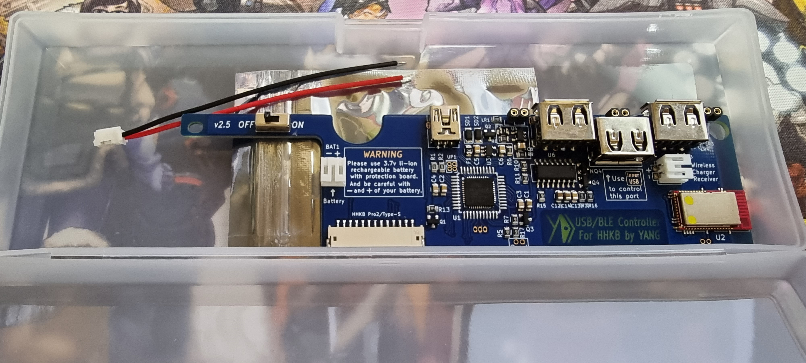
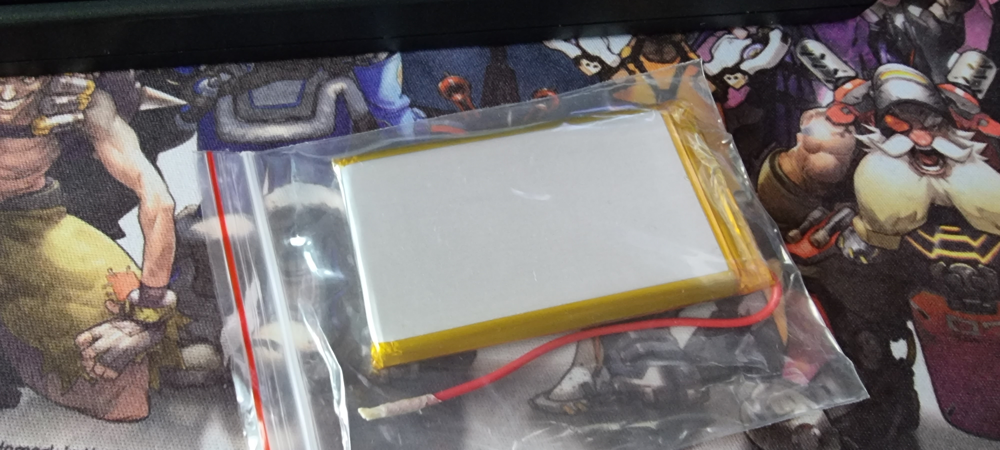
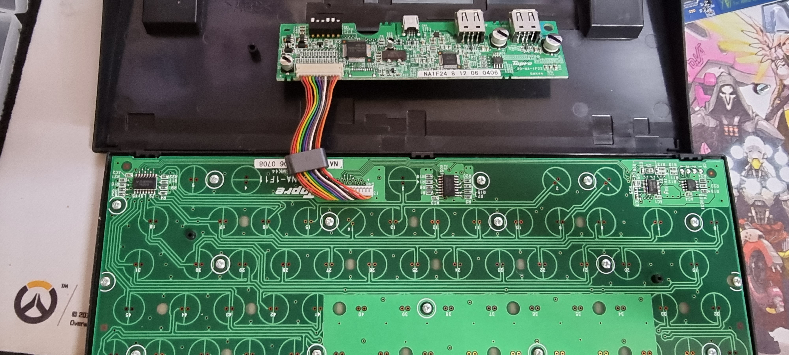
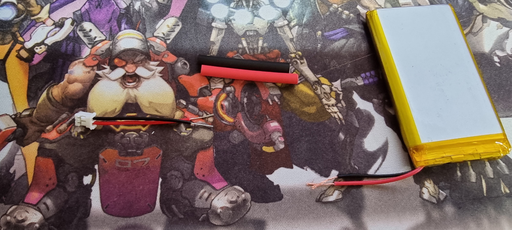
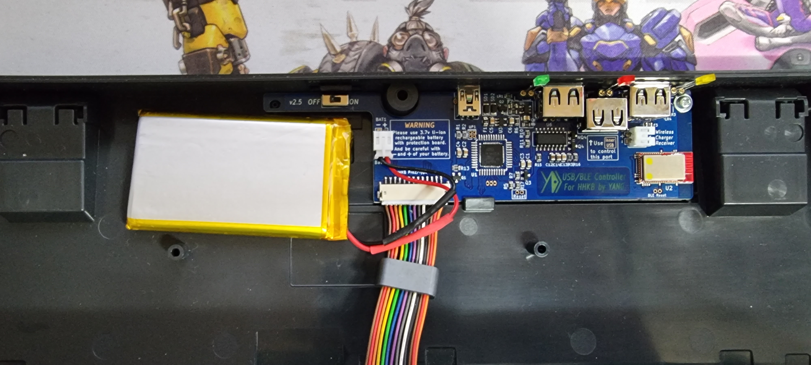
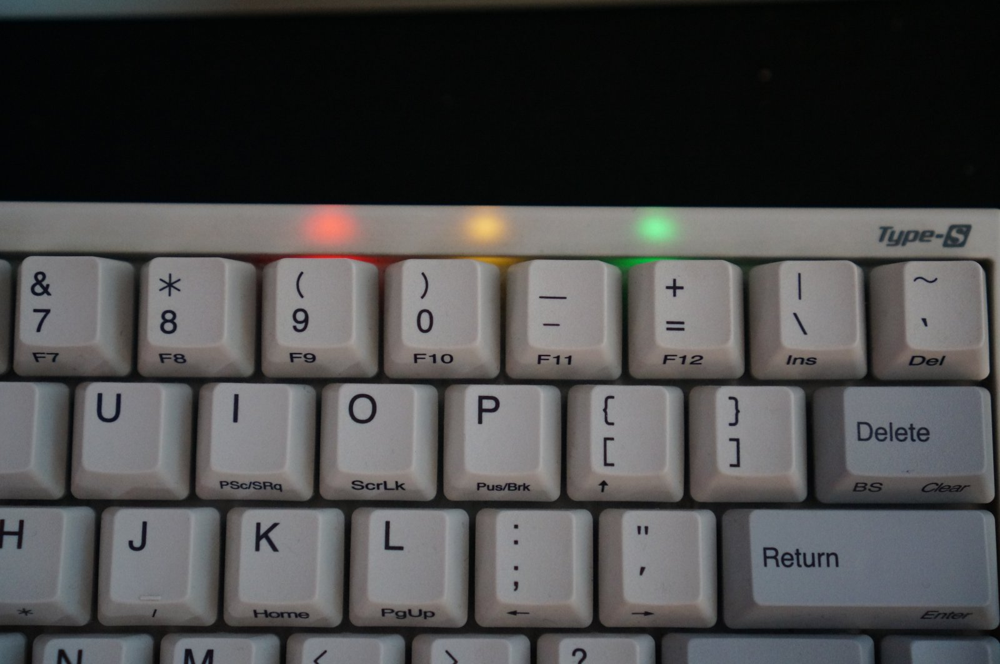
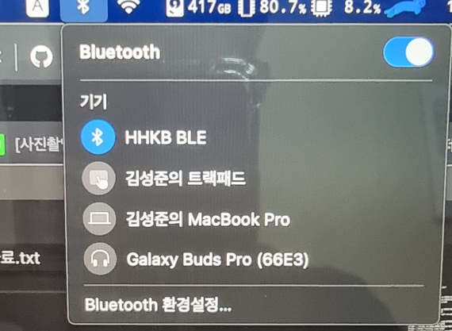
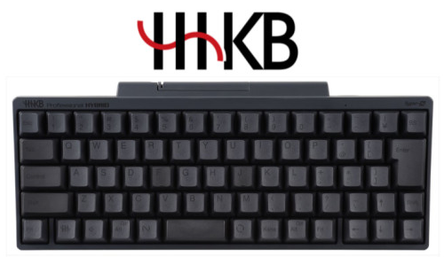
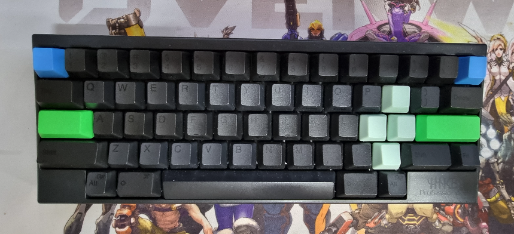

해피해킹(**HHKB**)키보드를 쓴지도 3년 정도 되었습니다.

Lindy케이블을 연결하여 매우 만족스럽게 사용하고 있었지만, 있었지만 선이 좀 거추장스러워서
블루투스 지원 키보드 구매를 고려하고 있었습니다.

우연히 **블루투스** 튜닝에 대한 내용을 알게되어 직접 튜닝을 해보았습니다.

***

## 준비물 구매

[블루투스 기판](https://kbdfans.com/products/hhkb-ble-mod-upgrade-module)

해피해킹 블루투스 연동 `기판`은 위 사이트에서 구매하였습니다.

배송은 일주일정도 걸렸던 것 같습니다.

[리튬-이온 배터리](https://ko.aliexpress.com/item/4000032162701.html)

`리튬 이온 배터리`는 국내에서도 구할 수 있었는데, 크기나 용량이 다 애매했습니다.

최소 **3000mAh**이상의 용량을 추천하지만, 두께가 너무 두꺼웠습니다. 

어쩔 수 없이 알리익스프레스에서 구매하였습니다.
배송이 오래걸린다는 소문이 많아서 걱정했지만, 2주정도 걸린 것 같습니다.

## 튜닝하기

실패하면 어쩌나 조금 걱정됬지만, 제품들이 도착하고 바로 튜닝을 시작했습니다.

기존 기판을 분리하고 새 기판을 세팅해줍니다.

튜닝자체는 크게 어렵지 않았습니다.

> `기판분리` → `기판 교체` → `배터리 결합` → `조립`

위 순서대로 진행하면 튜닝은 끝납니다.

다른 블로그 포스팅들과는 다르게 저에게 배송된 배터리는 피복을 벗겨야 진행이 가능했습니다.

다이소에서 **열 수축형 튜브**를 구매후 전선을 연결해주었습니다.

전원 커넥터는 기판에 동봉되어있었습니다.

조립했던 과정을 역행하면 튜닝은 완료됩니다.

제 키보드는 검은색이여서 LED 불이 나오지 않지만 흰색 키보드는 불빛이 보인다는 얘기도 들었습니다.

## 페어링

[https://ydkb.io/](https://ydkb.io/)

위 사이트에서 키맵을 변경해줄 수 있습니다. 개인적으론 기본세팅이 익숙해서 큰 변화는 주지 않았습니다.

페어링을 하면 아래와 같은 이름으로 페어링이 됩니다. 

## 마치며

해피해킹 BT는 새로 사기는 부담되는 가격이기도 하고 특유의 배꼽나온 디자인 때문에 고민을 많이했습니다.

하지만 이렇게 튜닝을 하니까 훨씬 더 깔끔한 형태가 나와 매우 만족스러웠습니다.

**10만원** 미만의 투자로 기존에 사용하던 모델을 그대로 사용할 수 있다는 점도 큰 메리트였습니다.

1. 3000mAh 기준 100% 완충시 체감상 2주 ~ 3주 정도 무선으로 사용할 수 있었습니다. (하루 10시간 사용)
   
    충전은 잘 때 선에 연결하고, 자고 일어나면 완충되어 있습니다.
  
2. 슬립모드 이후 블루투스 페어링은 시간이 조금 걸립니다. 저는 경우 `스페이스바`를 길게 눌러 연결을 하고 있습니다.
  
3. 블루투스 감도는 지연이 전혀 느껴지지 않는 정도로 **양호**했습니다.

혹시 고려하고 있는 분들이 있다면 강력추천 합니다.

***

## Reference

* [https://www.ummae.com/m/339](https://www.ummae.com/m/339)

* [https://dolgil2.tistory.com/96](https://dolgil2.tistory.com/96)

* [https://www.clien.net/service/board/cm_keyboard/15554606](https://www.clien.net/service/board/cm_keyboard/15554606)

* [https://bagng.tistory.com/181](https://bagng.tistory.com/181)

