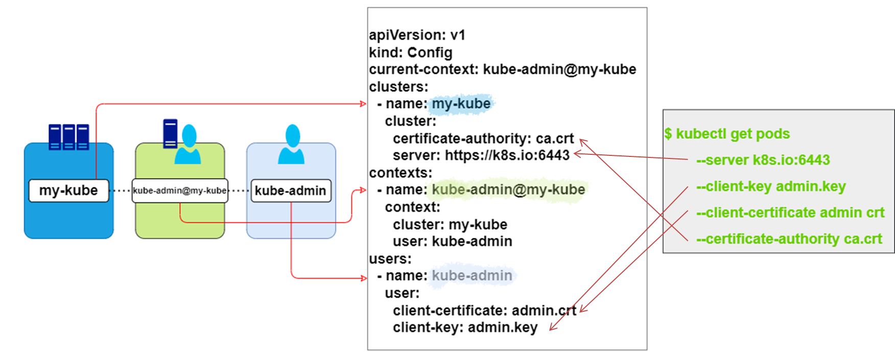

**CKA**를 준비하며 공부하고 있는 내용을 정리하고 있습니다.

부족한 부분도 많을 수 있습니다.

언제든 말씀해주시면 더 공부하고 수정하겠습니다.

---

## KubeConfig란?

REST API 또는 kubtctl 명령을 이용하여 정보를 호출할 때 추가적인 옵션을 통해 TLS인증을 거쳐야만 정상적인 정보를 받아볼 수 있습니다.

<br>

1. **REST API**

    ```shell
    $ curl https://k8s.io:6443/api/v1/pods \
        --key admin.key \
        --cert admin.crt \
        --cacert ca.crt
    
    {
        "kind": "PodList",
        "apiVersion": "v1",
        "metadata": {
          "selfLink": "/api/v1/pods"
        },
        "items": []
    }
    ```

2. **kubectl**

   ```shell
   $ kubectl get pods \
         --server k8s.io:6443 \
         --client-key admin.key \
         --client-certificate admin crt \
         --certificate-authority ca.crt
   
   No resources found.
   ```

위처럼 각종 **인증정보(key, crt 등)** 를 같이 보내야만 정상적인 결과를 받을 수 있습니다.

이 방법은 정보를 조회할 때만다 동일한 옵션을 추가해야하는 **번거로움(단점)** 이 있습니다.

이런 불편함을 줄이고 활용도를 높이기 위해 인증정보를 저장하는 `Object`가 <span class="em red">KubeConfig 입니다.</span>

### 기본 정보

> 기본 디렉토리: `$HOME/.kube/config`

다른 오브젝트들 처럼 생성/배포하는 개념이 아니라, 작업자의 Local환경에 저장하는 **환경파일의 일종**입니다. ssh의 `known_hosts`와 비슷하다고 볼 수 있습니다.

---

## KubeConfig 구성



### clusters

실제 유저가 접속하는 대상이 되는 서버(k8s-cluster)정보입니다.

서버와 관련된 정보(Host, IP, Port)를 저장합니다.

### users

클러스터로 접속하는 유저의 계정정보입니다.

접근하려는 유저계정의 인증정보(key, ca, crt 등)를 저장합니다.

### contexts

cluster와 user의 정보를 바탕으로 하는 접속정보

어떤 user가 어떤 cluster로 접근할 것인지에 대한 정보를 정의합니다.

> 새로운 계정이나 클러스터를 생성하는 것이 아니라 존재하는 정보를 바탕으로 정의하는 것.

```yaml
apiVersion: v1
kind: Config
current-context: kube-admin@my-kube # contexts.name
clusters: # Array
- name: my-kube
  cluster:
    certificate-authority: ca.crt
    server: https://k8s.io:6443
contexts: # Array
- name: kube-admin@my-kube
  context:
    cluster: my-kube # clusters.name
    user: kube-admin # users.name
    namespace: prod # 해당 클러스터 내의 특정 namespace를 설정
users: # Array
- name: kube-admin
  user:
    client-certificate: admin.crt
    client-key: admin.key
```

미리 정의된 여러가지 context들 중에서 **기준이 될 context**를 `current-context`에 세팅합니다.

---

## 명령

kubeconfig를 확인하는 다양한 방법이 있다.

1. 현재 정의된 config파일의 내용 확인
   
   ```shell
   $ kubectl config view
   ```

2. `Custom-config`파일의 내용 확인. 단, **default는 기준 디렉토리 내의 config파일**

   ```shell
   $ kubectl config view --kubeconfig=<custom-file>
   ```

3. `current-context`를 변경. config파일 내용도 자동으로 변경됨.

   ```shell
   $ kubectl config use-context <context_name>
   ```
   
---

## 다른 정의 방법

기본적으로 KubeConfig는 **인증정보(key, crt)** 를 `경로(path)`로 지정합니다.

하지만 다른 방법으로도 해당정보들을 정의할 수 있습니다.

```yaml
apiVersion: v1
kind: Config

clusters: 
- name: my-kube
  cluster:
    certificate-authority-data: "<Base64>LS0t .... TUVPbnJ" # Base64
...
```

```shell
$ cat ca.crt | base64
// base64 encoding된 인증서 문자열

$ echo "LS0t .... TUVPbnJ" | base64 --decode
// base64 decoding된 인증서 내용
```
***

## Reference

* [Kubernetes - KubeConfig](https://kubernetes.io/ko/docs/concepts/configuration/organize-cluster-access-kubeconfig/)
