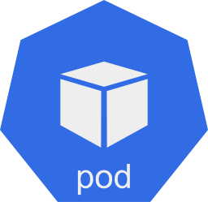
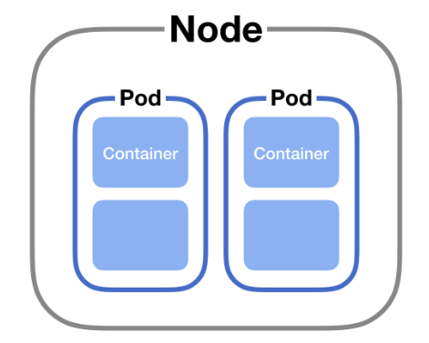

**CKA**를 준비하며 공부하고 있는 내용을 정리해보려고 합니다.

공부 순서대로 정리를 하고 있어서 다소 부족한 부분도 많을 수 있습니다.

---

## 파드(Pod)란?



`Pod(이하 파드)`는 쿠버네티스가 만들 수 있는 가장 작은 오브젝트이며, 기본이 되는 **배포 단위**입니다.

파드는 하나 이상의 컨테이너를 포함하며, 컨테이너를 개별적으로 배포하기 보다 컨테이너들의 그룹인 파드를 배포하며 운영하게 됩니다. 


## 파드는 왜 필요할까?

컨테이너는 `단일 프로세스`를 실행하는 것을 목적으로 설계되었습니다. (_단, 프로세스가 자식 프로세스를 생성하는 것은 제외합니다._)

이런 단일 컨테이너(혹은 컨테이너 그룹)를 직접 관리하는 것이 아닌 **파드**라는 한 개의 단위로 통합 관리하면 많은 편의성을 얻을 수 있습니다. 

일반적으로 쿠버네티스에서 사용자가 직접 **싱글톤 파드**를 포함하여 **개별 파드**를 만드는 경우는 거의 없습니다.

이는 파드가 상대적으로 `일회용 엔티티`로 설계되었기 때문입니다. 

파드가 생성될 때(사용자가 직접 또는 컨트롤러가 간접적으로), 새 파드는 클러스터의 `노드`에서 실행되도록 스케줄링 됩니다.

파드는 파드 실행이 완료되거나, 삭제되거나, 리소스 부족으로 인해 축출되거나, 노드가 실패할 때까지 스케줄링된 노드에 남아있습니다.

> 파드 내 컨테이너를 다시 시작하는 것과 파드를 다시 시작하는 것은 다릅니다.
> 
> 파드는 프로세스가 아니라 **컨테이너를 실행하기 위한 환경**일 뿐입니다.
 

### 파드의 사용

쿠버네티스 클러스터에서 파드는 두 가지 주요 방식으로 사용됩니다.

- **단일 컨테이너를 실행하는 파드**

  "**파드 당 하나의 컨테이너**" 모델은 가장 일반적인 쿠버네티스 `Use-Case`입니다. 파드를 단일 컨테이너를 둘러싼 `래퍼(Wrapper)`라고 할 수 있습니다. 쿠버네티스는 컨테이너를 직접 관리하는 대신 파드를 관리합니다.

- **다중 컨테이너를 실행하는 파드**

  파드끼리 밀접하게 결합되어 있고 리소스를 공유해야 할 때, 여러 개의 컨테이너로 구성된 애플리케이션을 캡슐화할 수 있습니다. 이와 같이 함께 배치된 컨테이너는 하나의 결합된 서비스 단위를 형성합니다. *ex) 사이드카 패턴*

  > 단일 파드에서 함께 배치 또는 관리되는 여러 컨테이너를 그룹화하는 것은 비교적 고급 `Use-Case`입니다.
  

### 스케일링

일반적으로 한개의 파드는 애플리케이션의 단일 인스턴스를 실행합니다.

더 많은 인스턴스를 실행하여 더 많은 리소스를 제공하기 위해 애플리케이션을 수평적으로 확장(`Scale Out`)하려면, 각 인스턴스에 하나씩, 여러개 파드를 사용해야 합니다.

즉, `Scale Out`을 할 때 단일 파드 안에서 여러 개의 어플리케이션을 실행하는 것이 아니라, 구별된 파드 자체를 쿠버네티스 클러스터 또는 노드에서 추가시키는 방식입니다.

만약 사용자가 수용량(Pod의 추가) 이상으로 증가한다면 노드를 추가하므로서 **물리적인 수용량**을 증가시킵니다.

> Containers running your application to scale up. You **create new pods** and to scale down. You **delete existing pod**.



## 파드의 특징

1. 파드 내의 컨테이너는 **IP와 Port를 공유**합니다.

   같은 파드안의 어플리케이션들은 `localhost`로 통신하며 같은 네트워크에 존재한다고 볼 수 있습니다.

   예를 들어, A컨테이너가 **8080**, B컨테이너가 **7001**로 배포되었다면, B가 A를 호출할 때 **localhost:8080** 으로 호출하면 되고, 반대는 **localhost:7001**로 호출하면 됩니다.

   따라서, 파드 안 컨테이너에서 실행 중인 프로세스가 같은 **포트 번호를 사용하지 않도록 주의해야 합니다**.

2. Pod 내에 배포된 컨테이너간에는 디스크 볼륨을 공유할 수 있습니다.

   일반적인 컨테이너 환경은 `파일 시스템`이 분리되기 때문에, 애플리케이션이 배포된 컨테이너의 파일 시스템 공유가 불가능하지만, 쿠버네티스의 경우 하나의 파드 내에서는 컨테이너들끼리 **볼륨을 공유**할 수 있기 때문에 다른 컨테이너의 파일을 읽을 수 있습니다.

## 템플릿

`yaml`파일은 기본적으로 4개의 `TOP(root)-level property`를 갖습니다.

```yaml

# Pod.yaml
apiVersion: v1 
kind: Pod 
metadata:
  name: my-app
  label:
    app: my-app
spec:
  containrs:
    - name: nginx-pod
      image: nginx 
      ports:
        - containerPort: 8080

```

1. apiVersion

   스크립트를 실행을 위한 쿠버네티스 **API 버전**. 보통 `v1` 사용. 

2. kind

   리소스의 종류

3. metadata

   리소스의 각종 메타 데이타. 라벨(`label`)이나 리소스의 이름(`name`)등의 식별자.

4. spec

   리소스에 대한 상세한 스펙.

   위에서는 Pod에 대한 리소스(컨테이너)를 정의하고 있습니다. 

    * 이름: `nginx-pod`
    
    * 컨테이너 이미지: `nginx` (일반적으로 **Docker**)  
    
    * 컨테이너 포트: `8080`

## 명령 실행

파드를 생성하는 방법은 여러가지가 있다.

* run

    ```shell
    $ kubectl run nginx --image=nginx
    ```

* create/apply

    ```shell
    $ kubectl create -f Pod.yaml

    $ kubectl apply -f Pod.yaml
    ```

* Dry-run

    ```shell
    $ kubectl cerate -f Pod.yaml --dry-run=client -o yaml
    ```

* pod 확인

    ```shell
    $ kubectl get pod
    ```
  
    ```shell
    NAME                    READY   STATUS     RESTARTS   AGE
    nginx-pod               1/1     Running    0          10s
    ```

* pod 확인 (Detail)

    ```shell
    $ kubectl get pod -o wide
    ```

    ```shell
    NAME                    READY   STATUS     RESTARTS   AGE   IP    NODE ...
    nginx-pod               1/1     Running    0          10s
    ```
***

## Reference

* [Kubernetes - POD](https://kubernetes.io/ko/docs/concepts/workloads/pods/)

* [쿠버네티스 #2 - 개념 이해 (1/2)](https://bcho.tistory.com/1256?category=731548)

