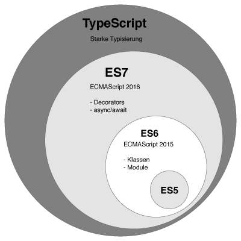

## Typescript 란?



Typescript는 MS에서 만든 <span class="em red">Javascript의 상위 언어</span>로써, 서로 다른 언어가 아니다. **컴파일 언어**이자, **정적 타입 언어**이다. 
Javascript는 인터프리터 언어지만, Typescript는 컴파일 언어로 코드 수준에서 미리 타입을 체크하여 오류를 체크해낸다. 
단 전통적인 컴파일 언어와는 다르게, **링킹 과정이 생략되어 있다.**

1. Typescript = Javascript + Type


2. 컴파일 단계에서 **타입 오류**를 잡아낼 수 있고, **코드 어시스트 기능**도 지원받을 수 있다.


3. 암묵적 형변환, 호이스팅, 복잡성 **문제를 해결**할 수 있다.

### 왜 좋은데?

1. type이 추가되어 **안정성 확보**


2. type에 대한 **예외처리 설정 불필요**

    예외처리가 빈번하게 발생할 수록 오버헤드가 생기지만, Typescript로 타입이 지정 될 시 위와 같은 예외처리 코드를 사용할 필요가 없다.

3. JS엔진에 **최적화 작업 성능 증가**

    JS엔진은 **hot function(자주 호출되는 함수)에 대해 최적화**를 수행한다. 이런 최적화와 해체 작업이 반복되면 성능이 저하되므로 TS에서는 type을 지정하고 컴파일 과정에서 검사하기 때문에 최적화 해체가 발생할 상황이 적어진다.

### 왜 써야되지?

1. 타입 체크

    위 장점과 같은 이유로 타입추가로 인한 안정성 확보가 가능하다.
2. OOD 지향을 통한 이점

    Interface와 같은 구현으로 Javascript보다 OOP를 지향하며 개발할 수 있다. 그에 따라 확장성, 편리성, 생산성 등을 높일 수 있다.
    
3. 써드파티 개발 시 유용함

    선언 파일(.d.ts)을 통해 써드파티 개발 시 높은 통찰력을 줄 수 있다.

***

## SOLID

### Single Responsiblity Principle (단일 책임 원칙)

클래스, 함수 등은 단 하나의 책임만을 가져야 한다. 여기서 <span class="em red">책임이란, '기능'</span> 정도의 의미이다. 

설계를 잘한 프로그램은 기본적으로 새로운 요구사항과 프로그램 변경에 영향을 받는 부분이 적다. 

즉, **응집도는 높고 결합도는 낮은 프로그램을 뜻한다.** 

만약 한 클래스가 수행할 수 있는 기능, 즉 **책임이 많아지면** 클래스 내부의 함수끼리 강한 결합을 발생할 가능성이 높아진다. 

이는 **유지보수에 비용이 증가**하게 되므로 따라서 책임을 분리시킬 필요가 있다.
  
<span class="callout">클래스를 수정할 **이유가 오직 하나**여야한다는 뜻</span>
  
### Open-Closed Principle (개방-패쇄 원칙)

기존의 코드를 변경하지 않고 **(Closed)** 기능을 수정하거나 추가할 수 있도록 **(Open)** 설계해야 한다.
 
OCP에 만족하는 설계를 할 때 <span class="em red">변경되는 것이 무엇인지에 초점</span>을 맞춘다.

자주 변경되는 내용은 수정하기 쉽게 설계 하고, 변경되지 않아야 하는 것은 수정되는 내용에 영향을 받지 않게 하는 것이 포인트다.

이를 위해 자주 사용되는 문법이 <span class="em red">인터페이스(Interface)</span>이다. (ex) 전략패턴

### Liskov Substitution Principle (리스코프 치환 원칙)

리스코프 치환 원칙은 MIT 컴퓨터 사이언스 교수인 리스코프가 제안한 설계 원칙이다.

`부모 클래스`와 `자식 클래스` 사이의 행위에는 **일관성**이 있어야 한다는 원칙이며, 

이는 객체 지향 프로그래밍에서 부모 클래스의 인스턴스 대신 자식 클래스의 인스터스를 사용해도 문제가 없어야 한다는 것을 의미한다.

상속 관계에서는 일반화 관계(IS-A)가 성립해야 한다. 일반화 관계에 있다는 것은 일관성이 있다는 것이다. 

따라서 리스코프 치환 원칙은 **일반화 관계에 대해 묻는 것**이라 할 수 있다.

### Interface Segregation Principle (인터페이스 분리 원칙)

한 클래스는 자신이 <span class="em red">사용하지 않는 인터페이스</span>는 구현하지 말아야 한다. 

하나의 일반적인 인터페이스보다는, 여러 개의 구체적인 인터페이스가 낫다.

이는 다시 말해서, **자신이 사용하지 않는 기능(인터페이스)에는 영향을 받지 말아야 한다는 의미이다.**
  
### Dependency Inversion Principle (의존 역전 원칙)**

의존 관계를 맺을 때, 변화하기 쉬운것 보단 <span class="em red">변화하기 어려운 것에 의존</span>해야 한다는 원칙이다.

여기서 말하는 **변화하기 쉬운 것**이란 **구체적인 것**을 말하고, **변화하기 어려운 것**이란 **추상적인 것**을 말한다. 

객체지향적인 관점에서 보자면 변화하기 쉬운것이란 **구체화 된 클래스**를 의미하고, 

변화하기 어려운 것은 `추상클래스`나 `인터페이스`를 의미한다. 

따라서 **DIP를 만족한다는 것은 의존관계를 맺을 때, 구체적인 클래스보다 인터페이스나 추상 클래스와 관계를 맺는다는 것을 의미**한다.

***

## Typescript에서는?

### SRP

```typescript
/*
* SRP의 잘못된 적용 예
*/
class Entity {
  private dbCon: Database;

  constructor(
    private title: string,
    private deadline: Date,
  ) {
    this.dbCon = Database.connect("admin:password@db")
  }

  get title(): string {
    return `${this.title} (${this.deadline})`
  }

  save(): any {
    this.dbCon.save({ title: this.title, date: this.deadline })
  }
}
```
    
같은 클래스내에서 데이터모델의 `property` 와 데이터모델에 엑세스하는 `save` 메소드가 같이 정의되어 있다.
    
```typescript
/*
* SRP의 적용 예
*/
class Entity {
  constructor(
    private title: string, 
    private deadline: Date
  ) {
  }
  
  get title(): string {
    return `${this.title} (${this.deadline})`
  }
}

class Repository {
  private dbCon: Database;

  constructor() {
    this.dbCon = Database.connect("admin:password@db")
  }

  save(task: Entity) {
    this.dbCon.save(task)
  }
}
```

데이터모델의 `property` 와 데이터모델에 엑세스하는 `save` 메소드를 확실히 분리하여 수정의 목적을 **한 개로 제한한다.**

### OCP

```typescript
/*
* OCP의 적용 예(1)
*/
class CreditCard {
  private code: String
  private expiration: Date
  protected monthlyCost: number

  constructor(
    code: String,
    Expiration: Date,
    MonthlyCost: number,
  ) {
    this.code = code
    this.expiration = Expiration
    this.monthlyCost = MonthlyCost
  }

  get Code(): String {
    return this.code;
  }

  get Expiration(): Date {
    return this.expiration;
  }

  monthlyDiscount(): number {
    return this.monthlyCost * 0.02;
  }
}

class GoldCreditCard extends CreditCard {
  // **Overriding**
  monthlyDiscount(): number {
    return this.monthlyCost * 0.05;
  }
}

class SilverCreditCard extends CreditCard {
  // **Overriding**
  monthlyDiscount(): number {
    return this.monthlyCost * 0.03;
  }
}
```

```typescript
/*
* OCP의 적용 예(2)
*/
interface playAlgorithm {
  ext: string
  play: () => void
}

class Wav implements playAlgorithm {
  ext: string
  constructor() {
    this.ext = '.wav'
  }
  // **Overriding**
  play(): void {
    console.log(`play ${this.ext} file`)
  }
}

class FLAC implements playAlgorithm {
  ext: string
  constructor() {
    this.ext = '.flac'
  }

  // **Overriding**
  play(): void {
    console.log(`play ${this.ext} file`)
  }
}

class SoundPlayer {
  private file: playAlgorithm

  setFile(file: playAlgorithm) {
    this.file = file
  }

  play(): void {
    this.file.play()
  }
}
```

수정할 때 기존코드를 건드리지 않고 `close` , 기능 추가가 가능하다 `open`

### LSP
    
```typescript
/**
* LSP 적용 예(1)
*/
class Person {
  introduce(name: string): string {
    return `My name is ${name}.`
  } 
}

class Slave extends Person {
  introduce(name: string): string {
    return `my name is ${name}, my lord.`
  }
}

class Master {
  showMySlave(slave: Person) {
    const msg = slave.introduce('name')
    console.log(msg)
  }
}
```

```typescript
/**
* LSP 적용 예(2)
*/
abstract class PostalAddress {
  city: string;

  /*
  * @returns Formatted full address
  */
  abstract WriteAddress(): string;
}

class ItalyPostalAddress extends PostalAddress {
  WriteAddress(): string {
    return "Formatted Address Italy" + this.city;
  }
}
class UKPostalAddress extends PostalAddress {
  WriteAddress(): string {
    return "Formatted Address UK" + this.city;
  }
}
class USAPostalAddress extends PostalAddress {
  WriteAddress(): string {
    return "Formatted Address USA" + this.city;
  }
}

class AddressWriter {
  PrintPostalAddress(writer: PostalAddress): string {
    return writer.WriteAddress();
  }
}
```

즉, **업캐스팅**을 해도 아무런 문제가 안되어야 한다는 것이다.

###  ISP

```typescript
/**
* ISP의 잘못된 예
*/
interface Printer {
  copy(): void
  print(doc: string): void
  staple(doc: string, page: number): void
}

class SimplePrinter implements Printer {
  copy(): void {
    console.log('copy...')
  }

  print(doc: string): void {
     console.log(`pring ${doc}`)
  }

  staple(doc: string, page: number): void {
     console.log(`${doc} staple per ${page}`)
  }
}
```

프린트는 `staple` 기능을 수행하지 않는다. 하지만 `interface` 에 정의되어 있다.
물론 위의 코드가 동작하지 않는 것은 아니다.

```typescript
/**
* ISP의 적용 예
*/
interface Printer {
  print(doc: string): void
}

interface Stapler {
  staple(doc: string, page: number): void
}

interface Copier {
  copy(): void
}

class SimplePrinter implements Printer {
  print(doc: string): void {
    console.log(`pring ${doc}`)
  }
}

class SuperPrinter implements Printer, Stapler, Copier {
  copy(): void {
    console.log('copy...')
  }

  print(doc: string): void {
    console.log(`pring ${doc}`)
  }

  staple(doc: string, page: number): void {
    console.log(`${doc} staple per ${page}`)
  }
}
```

물론 위 처럼 `interface` 를 세분화한다면 그 갯수도 늘어난 다는 점 때문에 단점이 아닐까 생각할 수 있다.
하지만, 큰 관점에서 본다면 세분화된 `interface` 를 통해 다양한 상황에서 여러가지 클래스를 생성할 수 있고,
수정포인트가 줄어든다는 점은 확실한 장점이라고 할 수 있다.

<span class="callout">인터페이스 분리 원칙을 통해 시스템의 내부 의존성을 약화시켜 **리팩토링, 수정, 재배포**를 쉽게 할 수 있다.</span>

### DIP
    
```typescript
/**
* DIP 잘못된 예
*/
class CarWindow {   
  open(): void {
    console.log('window is open...')
  }

  close(): void {
    console.log('window is close...')
  }
}

class WindowSwitch {
  private isOn: boolean

  constructor(
    private window: CarWindow
  ) {
    this.isOn = false
  }

  onPress(): void {
    if (this.isOn) {
      this.window.close()
      this.isOn = false
    } else {
      this.window.open()
      this.isOn = true
    }
  }
}
```

```typescript
/**
* DIP 적용 예
*/
interface IWindow {
  open(): void;
  close(): void;
}

class CarWindow implements IWindow {
  open(): void {
    console.log('window is open...')
  }

  close(): void {
    console.log('window is close...')
  }
}

class WindowSwitch {
  private isOn = false;

  constructor(
    private window: IWindow
  ) {
    this.isOn = false
  }

  onPress(): void {
    if (this.isOn) {
      this.window.close()
      this.isOn = false
    } else {
      this.window.open()
      this.isOn = true
    }
  }
}
```

```typescript
/*
* DIP의 잘못된 예(2)
*/
interface playAlgorithm {
  ext: string
  play: () => void
}

class FLAC implements playAlgorithm {
  ext: string
  constructor() {
    this.ext = '.flac'
  }

  // **Overriding**
  play(): void {
    console.log(`play ${this.ext} file`)
  }
}

class SoundPlayer {
  private file: playAlgorithm

  setFile(file: FLAC) {
    this.file = file
  }

  play(): void {
    this.file.play()
  }
}
```

*DIP를 만족한다는 것은 의존관계를 맺을 때, 구체적인 클래스보다 **인터페이스나 추상 클래스와 관계**를 맺는다는 것을 의미한다.*
